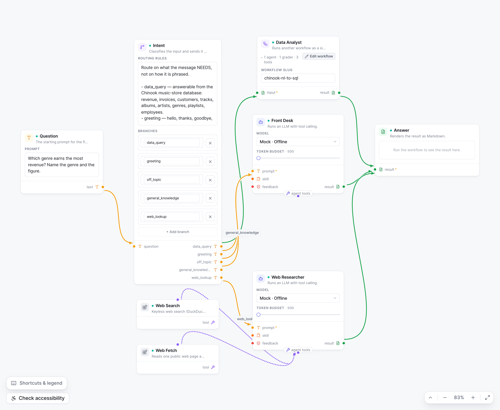
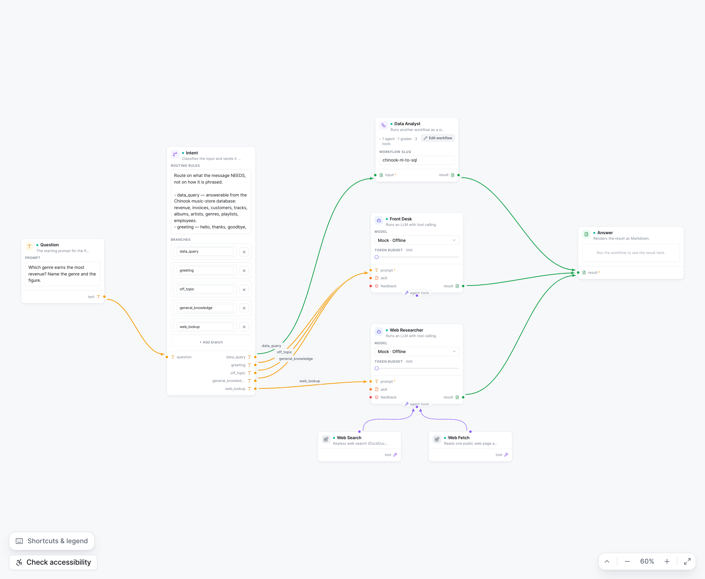
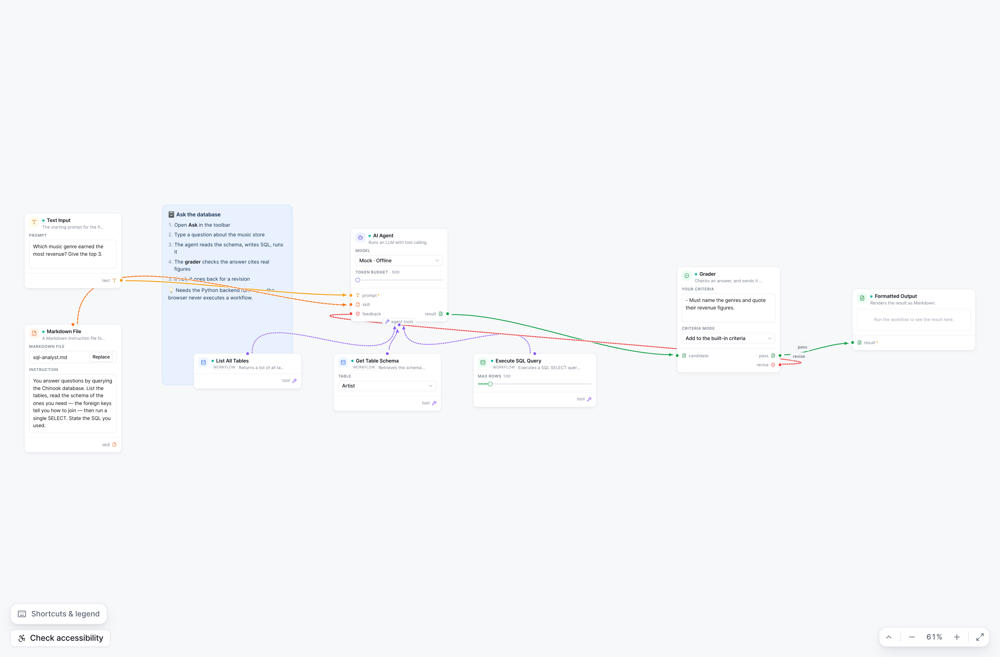

# Curves that do not cross, at a spacing that reads

Ticket: `.scratch/consistency-sweep/tickets/08-edge-legibility.md`
Status: adopted · 2026-08-11 — **one part reversed the same day**, see
[The skill was not equipment after all](#the-skill-was-not-equipment-after-all)
at the foot of this document. The tool shelf stands; `skill` no longer rides it.

The owner's complaint: *"I am not so happy with the spacing, how the curves
overlap each other — what is professional and industry standard of tweaking,
showing nice curves?"*

## The constraint that shapes every answer below

> **Correction (ticket 09, 2026-08-11): the paragraph below is false, and it
> was repeated to the owner in conversation.** The routers that avoid obstacles
> are **not** paid. `node -e "console.log(Object.keys(require('@joint/core').routers))"`
> against the installed package returns `manhattan, metro, normal, oneSide,
> orthogonal, rightAngle`; `manhattan` is the obstacle-avoiding one and
> `rightAngle` is purpose-built for port-anchored orthogonal links. The claim is
> load-bearing — it is the reason a real defect (the back-edge crossing two
> cards, below) was written off as a stack limit instead of fixed — so it is
> left standing with this correction rather than quietly rewritten. Everything
> measured in this document is still true *of curves*; what is superseded is the
> premise that curves were the only option. See
> `docs/decisions/orthogonal-routing.md`.

~~JointJS's free `curve` connector **cannot avoid obstacles**, and the routers
that can are in the paid tier. So a line has no way to dodge a card it is
pointed at. Every lever available is therefore a *layout* lever — where the
cards are and which cards the layout engine is even allowed to rank — and
nothing here asks the connector to be cleverer than it is.~~

The recent tangent work in `canvas/links/edgeDecoration.ts` (each end's tangent
pinned to the side its port actually sits on) is left alone. It is measured
below and it is doing its job.

## How the measurement works

Adjectives are not evidence, so both pictures are scored by the same script:
every link path is sampled every 2px in graph coordinates and tested against

- **card crossings** — a sample lands strictly inside a card's model rectangle.
  A path may touch its own endpoints' cards within 14px of the port it attaches
  to and no further. Port dots and the tool-bus pill hang outside the card by
  design, so they do not inflate it. Frames (`annotation` / `container`) are
  *not* obstacles: a frame is a background region things sit inside.
- **edge crossings** — two paths intersect. Two links meeting **at one port**
  is a join, not a crossing, and is excluded; two links arriving at *different*
  ports on the same card is a crossing and is counted.

The rig drives the real editor through Playwright, clicks the real
**Arrange automatically**, fits, and screenshots. It lives outside the repo (it
needs a debug handle on `PaperController` that must not ship).

## Before → after

`chinook-assistant`, `Arrange automatically`, fit to screen:

| | card crossings | edge crossings | extent | aspect |
| --- | --- | --- | --- | --- |
| before | **1** | **3** | 1408 × 1039 | 1.36 |
| after | **0** | **0** | 2006 × 1041 | 1.93 |

*Before.* Web Search and Web Fetch are ranked as ordinary predecessors, so they
land in a column beside the router and read as a stage of the flow; their two
binding curves sweep right, cross each other, and one runs straight across the
Web Researcher card it is bound to. The router's four branch labels pile up in
a 96px gap — `web_lookup` is clipped by the card it points at — and the
`data_query` branch crosses all three branches heading for Front Desk.

*After.* The two tools are a shelf under their agent, reached by two short
symmetric hops into the bus. Every branch label sits in the gap it belongs to.
No line crosses a card; no line crosses another line.

The same is true in the top-to-bottom reading (0 / 0), where the shelf rotates
onto the consumer's flank with the bus.

## What was adopted

### 1. Equipment is not a rank of the flow

`src/canvas/layout/bindingLayout.ts`.

A tool is wired *tool → agent*, so a layered algorithm reads it as a
predecessor. But the model already says otherwise: `BINDING_SIDE` in
`core/model/contracts/ports.ts` puts a capability's output on a card's **top**
and the bus that gathers them **under** the card that uses them — across the
reading axis, deliberately, "so a binding never looks like a stage of the
flow". Layout simply had not been told. The classification here is not a new
rule; it is the existing one, read by the thing that positions cards.

So binding edges are withheld from the ranking, and a node whose every edge is
a binding it *provides* is withheld too and hung under its consumer.

The part that matters is that **the shelf is reserved before the layout runs**,
not nudged into place afterwards: the consumer's box is reported to dagre as
its own size plus the shelf, on both axes, so neighbouring ranks are kept clear
of a band that turns out to hold tools and nothing can collide. This mirrors
how ELK defines spacing — measured from a node's *margin*, which
["encompasses the node, its ports, and labels"][elk-spacing] — with a tool
shelf as one more thing inside the consumer's margin.

Reserving only the axis the shelf grows along was tried first and is wrong: a
three-tool shelf is far wider than the agent above it, and the ends of the row
hung over the rank beside it, landing on a markdown card.

A tool bound to **two** agents goes on the shelf of the first consumer it was
wired to and reaches the other with an ordinary binding curve. Rejected
alternatives: reserving space on every consumer inflates several ranks for one
card; centring the tool between its consumers puts it in space no rank
reserved, which is exactly the overlap the shelf exists to prevent.

### 2. Spacing is a fraction of card width, and the fraction was measured

`src/design/tokens.ts` → `GRAPH_SPACING`.

The old numbers (96 / 48 / 24 / 40) were picked once and never re-derived when
the card settled at 252px wide. Width is the anchor because it is the one card
dimension design fixes — height runs from 72 to 700-odd with content, so a
height-derived gap would change meaning card by card.

Rank gap swept on `chinook-assistant`:

| rank gap | ÷ card width | card crossings | edge crossings |
| --- | --- | --- | --- |
| 96 (old) | 0.38 | 0 | 3 |
| 126 | 0.50 | 0 | 3 |
| 168 | 0.67 | 0 | 3 |
| 176 | 0.70 | 0 | 1 |
| 184 | 0.73 | 0 | 1 |
| **189** | **0.75** | **0** | **0** |
| 210 | 0.83 | 0 | 0 |
| 252 | 1.00 | 0 | 0 |

¾ is the threshold, and it is not one graph's lucky number: across
{`chinook-assistant`, `chinook-nl-to-sql`} × {left-to-right, top-to-bottom},
¾ is the best of the five ratios tried in every combination.

Two independent sanity checks agree with it. Normalised for node size the field
sits just below: Graphviz `dot` pairs a 0.5in [`ranksep`][gv-ranksep] with a
0.75in default node (0.67), and React Flow's own [ELK example][rf-elk] pairs a
100px `nodeNodeBetweenLayers` with a 150px node (0.67). And it clears our own
label rhythm: `edgeDecoration` puts a five-way router's last branch label
50 + 4 × 26 = 154px along its link, so a shorter gap *guarantees* a label
printed on the downstream card — which is the clipped `web_lookup` in the
before shot.

Cross-flow spacing stays half the rank gap, which is Graphviz's documented
pairing (`ranksep` 0.5in, [`nodesep`][gv-nodesep] 0.25in). The old 96/48 already
honoured that ratio; only the magnitude was wrong. It is now written as
arithmetic so the two cannot drift apart.

Shelf clearance was measured the same way: at ⅙ of a card the outer tools of a
three-tool shelf drew their lines across the middle tool's card; ⅓ is where
that stops.

### 3. Edge order is imposed, not inherited

Dagre seeds its crossing-minimisation sweep from the order edges arrive in, and
it is far more sensitive to it than expected. Handing the same eleven links to
the same layout **in reverse**:

| link order | card crossings | edge crossings |
| --- | --- | --- |
| declared | 0 | 0 |
| reversed | 2 | 7 |

Declaration order happened to be the good order, because a router's branches are
authored top to bottom. "Happened to be" is not a property, and an edge list
survives an edit, a paste or a JSON round trip without promising to keep its
order — so `byDeclaredOrder` now sorts links by node and then by the source
port's index on its card. A router's branches reach dagre in the order their
labels read. On today's files this is a no-op; it is worth seven crossings the
first time an edge list is reordered.

## What was rejected

**Edge stubs — a short straight run out of the port before the curve begins.**
Rejected on measurement. The purpose of a stub is to make lines leave a port in
the port's own direction so they separate before diverging, and
`linkConnector`'s pinned tangents already do exactly that. Measured gap between
the router's five branch curves, along their own paths:

| along path | 0 | 8 | 16 | 24 | 32 | 48 |
| --- | --- | --- | --- | --- | --- | --- |
| tightest gap | 23.8 | 23.8 | 23.9 | 23.5 | 22.2 | 19.4 |

They leave the card fully separated at the port-row pitch (`NODE.portRowHeight`
= 24) and stay there. A stub would add vertices — which the model has nowhere
to store — to recover at most 4px at 48px out. Research also found **no**
source documenting a stub length: tldraw ships explicit
`expandElbowLegLength` constants, but for *elbow* arrows, a different routing
model, and keyed to the arrow's size token rather than to the target's
dimensions; ELK's `spacing.portsSurrounding` is port-to-corner padding, not
port-to-first-bend.

**Dagre's `ranker`.** `network-simplex` (default), `tight-tree` and
`longest-path` produce **identical** scores on both graphs in both directions.
Not a lever here; not exposed.

**Spacing that scales with node size, as a cited convention.** It was tempting
to claim the field derives spacing from node dimensions. It does not — verified
negative. ELK's spacing documentation is explicit that spacings start at a
node's *margin*, never that they are proportional to its size, and Graphviz's
`ranksep`/`nodesep` are absolute inches. The ratio here is ours, chosen because
our card width is fixed and our old constants had visibly stopped matching it;
the field is cited only as a sanity check on where the number lands.

**Widening every rank to fit edge labels (Graphviz's dummy-node trick).**
Graphviz models a labelled edge as a dummy node, which roughly doubles that
edge's rank gap. Dagre exposes the same thing through a link's `labelSize`, and
it is the better-targeted fix — only labelled edges pay. It needs the *rendered*
label's width, which means reaching the paper, which `AutoLayout` deliberately
does not have. Left for a later ticket; the ¾ ratio clears today's labels.

**PureMVC-style rewriting of the layout pass.** Not needed: the layout now
*reads* positions through `setPosition` and never writes to the graph at all,
which removed the previous run-then-rewind dance as a side effect.

## Where the bar is not met, and why

> **Superseded in part by one-chinook ticket 10 (2026-08-11).** Everything
> measured below was measured on the graphs of the time, and the *rule* it
> derived (¾ rank gap, branch order = destination order) is unchanged and
> still enforced. Two of the subjects are not:
>
> - `chinook-nl-to-sql` no longer exists. It was collapsed into
>   `chinook-assistant`, which is now thirteen nodes rather than eight and
>   carries the analyst's agent → grader → `revise` loop inline. So the
>   back-edge crossing described below as the analyst's is now the
>   assistant's, on the same cause.
> - The **seeded demo is no longer a hand-built graph at all**. `seedDemo.ts`
>   imports the shipped `workflow.json`, so "the graph a fresh browser opens
>   on" and "the one visible example" are the same document — and the second
>   cause below, a Markdown File wired into an agent, is now *in* that
>   document rather than only in the seed.
>
> Left standing rather than rewritten, per this record's own correction note
> further down: a decision record that silently restates what it measured is
> worth less than one that shows what changed underneath it.
>
> **The bar was re-measured on the collapsed document**, the same way and to
> the same standard — every link path sampled at 400 points against every
> card's box, at fit zoom, in the running editor. `chinook-assistant` still
> scores **0 card crossings**, and `workflow.json` now commits the positions
> that achieve it.
>
> One finding is new and belongs here rather than in a workflow's README:
> **`Arrange automatically` scores 1 on this graph, and the committed hand
> layout scores 0.** The engine ranks by graph depth, so it lifts the Web
> Researcher (one hop from the router) above the analyst (three hops: agent →
> tools → grader) and thereby *inverts* the branch order — sending the last
> branch's link back across the diagram, through four cards. "Branch order is
> the layout" is a rule the layout engine does not know, and on a graph whose
> branches have very unequal depth the two disagree. Not fixed here: changing
> the ranking heuristic is its own decision, and this is the first document
> that has exposed the gap.

The bar was *no line crosses a card at fit-zoom*. `chinook-assistant` meets it.
The **seeded demo** — the graph a fresh browser opens on, and the only shipped
graph that wires a Markdown File into an agent — did **not**, and here is the
picture rather than a euphemism:

> **Correction.** This section first attributed the picture to
> `chinook-nl-to-sql`. It is the seeded demo (`src/app/seedDemo.ts`);
> `chinook-nl-to-sql` contains no Markdown File node and never did, so the
> second cause below could not have appeared in it. The measurement was right
> and the label was wrong — recorded rather than quietly edited, because a
> decision record that silently changes what it claimed to have measured is
> worth less than one that shows its corrections.

Two card crossings were found, from two causes, neither of which is spacing.
**The second is now fixed** (see the section after this one); the first stands:

1. **The grader's `revise` back-edge** (red, far right → far left). An
   evaluator-optimizer loop runs *against* the flow across three ranks. A
   layered layout has no rank to put it in and a non-routing connector has no
   way to steer it around the cards it passes. No rank gap, ranker or edge
   order changes it. ~~The fix is either an obstacle-avoiding router (paid)~~
   — **the free `manhattan` router avoids obstacles; see the correction at the
   top** — or drawing back-edges deliberately, routed under the rank they
   return across. **Ticket 09 did both**, and needed both: `manhattan` clears
   every card by itself, but the corridor it picks is the band reserved for the
   tool shelf, so the return run then cuts across three tool bindings. The lane
   is now placed explicitly. See `docs/decisions/orthogonal-routing.md`.
2. **`Markdown File.skill → AI Agent.skill`.** ~~`AgentNode`'s `skill` input is
   an ordinary left-side port, not `BINDING_SIDE.consumer`.~~ **Fixed** — see
   below — and then **deliberately reintroduced**: the port went back to being
   an ordinary left-side input, and this crossing came back with it. The
   reversal and its reasoning are at the foot of this document.

## The half-declared binding, and how it was closed

> **Superseded.** Everything in this section happened and is accurately
> described, and the layout gain it reports was real and measured. It was
> reversed hours later because it cost something this section did not weigh:
> the dot left the card's left stack while the footer legend went on listing
> the port. See
> [The skill was not equipment after all](#the-skill-was-not-equipment-after-all).
> The `orchestrate.worker` half of it — that five node types read
> `plan.skill_bindings` and only two declared the port — stands untouched; only
> the *side* was reversed.

`MarkdownFileNode` declared its `skill` output as `BINDING_SIDE.provider`;
`AgentNode`'s `skill` *input* declared no side at all. `isBindingEdge` requires
both ends to agree — correctly, since a `result` landing on a bus-shaped port
is a real stage of the graph and classifying it as equipment would hide a step
under a card — so the wire read as flow, the markdown card was ranked as an
ordinary predecessor, and its line climbed past the text input above it.

**A skill is equipment.** The port contract had already said so in as many
words — it names "a tool, a **skill**, a worker pool" as bindings, and
`BINDING_SIDE`'s own note calls a tool's output and a Markdown file's `skill`
output "the same kind of thing — a capability offered upward". So declaring
`side: BINDING_SIDE.consumer` on the input is finishing a declaration, not
making a new claim. **`orchestrate.worker` had the identical gap** and was
fixed with it; a worker with no skill wired shows no symptom, which is why it
had to be looked for rather than waited for.

Three things had to survive the change, and each is pinned in
`src/nodes/skillBinding.test.ts`:

- **A skill still takes one file.** `maxConnections` stays 1; it shares an edge
  with the tool bus but is not one.
- **A tool still cannot be dropped into the skill port.** Connection validation
  never reads `port.side` — `typeCompatibilityRule` refuses it for exactly the
  reason it always did. Pinned anyway, because two ports on one edge is
  precisely the situation where a reader assumes they became interchangeable.
- **Both bindings rotate together.** `resolvePortSide` swings `skill` and
  `tools` onto the same flank in vertical flow, so the distinction between
  flow and binding survives the reading-direction toggle.

**One latent rendering bug had to be fixed first.** The bottom edge had only
ever held a single port, and two independent rules agreed on where its dot went
*by coincidence*: CSS draws `.node__pill` at `left: 50%`, and an even spread of
one port is also the halfway point. Adding a second port to that edge would
have moved the bus dot to two thirds while its pill stayed drawn at the middle,
so links would have arrived beside the thing they bind to. `bottomPorts.ts`
inverts the rule — **the dot follows the pill**, measured from the rendered
element rather than re-derived from a number that would have to be kept in step
with a stylesheet — and plain dots take the space the pill leaves, so a longer
label moves them without anyone editing a constant.

Measured on the seeded demo after the change, at the rendered pixels: the
agent's card spans x 589–671, its pill is centred at 630, the `tools` dot is at
**630** (on the pill) and the `skill` dot at **602** (clear of the pill's left
edge at 615). The Markdown File card lands at y=498 — the same row as all three
tools, the four of them centred under the agent at y=398. It is on the shelf,
and its crossing is gone.

Also visible: the annotation frame did not move with its children. Frames are
excluded from the ranking (a frame has no edges, so dagre would park it in an
arbitrary rank), but nothing re-fitted them around the children afterwards. A
separate defect, not an edge-legibility one — **now fixed**, see below.

## The frame that stayed behind

Excluding frames from the ranking is right; not putting them back was the bug.
`core/model/containerFit.ts` re-wraps every container around wherever its
children have *just* been placed, and `AutoLayout` does only the wiring.

It lives in `core/model/` rather than beside `bindingLayout` because two layers
need it — `GroupingController` when it creates a frame around a selection, and
`AutoLayout` when it re-fits one — and `controller/` may not import from
`canvas/`. A home in `canvas/` would have meant a second copy of the same
arithmetic, so the two would have disagreed the first time the padding changed.
`GroupingController` now calls the shared `fitAround` instead of its own copy.

Three cases the pure function carries, each a test:

- **Nesting** resolves depth-first, so an outer frame is measured against the
  *fitted* inner one rather than the rect it had before the layout.
- **A childless frame is absent from the result entirely**, so no move and no
  resize is emitted for it. Collapsing it would read as the layout deleting a
  label somebody placed on purpose.
- **The padding is asymmetric** — `top` is 128 for the title bar — and the
  minimum size grows the frame right and down only, so the gap above the first
  card is exactly `padding.top` whatever the minimum works out to.

One subtlety that is not arithmetic: `JointGraphAdapter` applies a move with
`{ deep: true }`, deliberately, so dragging a frame carries what is inside it.
The model moves only the node it was told about, so a frame's move shifts
children the graph already has positions for. `depthFirstOrder` emits ancestors
before descendants, which makes each node's own absolute set the last write for
it and keeps model and graph in agreement.

Measured on the seeded demo, at the rendered pixels: the frame wraps its one
child at `{ left 40, top 128, right 40, bottom 32 }` — 252 + 80 = **332** wide,
278 + 160 = **438** tall. A single undo restores the authored 340 × 470 and the
overlapping seed geometry, and leaves the Undo button disabled: the whole
arrangement, moves and re-fits together, is one history entry.

## The skill was not equipment after all

Ticket: `.scratch/skills-and-legibility/tickets/08-skill-is-a-left-input.md`
Reversed · 2026-08-11, hours after the section above was adopted, by the owner
looking at the result: *"the skill dot is still bottom, expected behaviour was
on the left as input like the prompt and feedback."*

### What the argument above got wrong

It was an argument about the *canvas* that never checked the *card*. Both
premises are still true — the port contract does name a skill as a binding, and
`isBindingEdge` does require both ends — but "the contract already says so" is
an appeal to a sentence, not a reason. Read the drawn consequence instead:

The footer legend is the card's **complete** list of ports; that is its whole
job. So the Agent card went on listing `prompt`, `feedback`, `skill` down its
left side while only two of those rows had a dot beside them. A reader counting
labels against dots found a hole, and the only repair on offer was to style the
odd row differently — a `.node__port--offside` treatment, which decorates the
symptom and leaves the reader still short one dot. That treatment was written
in the same sweep and is the tell: a rule that needs a special case for one row
of one card is describing something it got wrong.

The owner's model is the node-editor convention, and it is right. Text Input
feeds `prompt`, Grader feeds `feedback`, Markdown File feeds `skill`. Three
cards, three wires, three inputs — they arrive from the left.

### What actually distinguishes a bus

Not "attached rather than sequential" — that phrase covers a skill perfectly
well and still gives the wrong answer. The distinguishing fact is **many wires
converging on one point**. An agent's `tools` gathers however many tools the
workflow has; a supervisor's `workers` the same. That convergence needs a
drawn form of its own — the pill, one capsule with one dot — and it needs an
axis of its own, because a stack of left-hand rows cannot express it.

A skill is one file on one wire. It never had that reason to leave the reading
axis; it only had a tool's *company*. So `tools` stays exactly where it was and
`skill` (`src/nodes/skillLayer.ts`, declared once for all five model-driven
types) drops its `side` and takes the left-hand default.

`MarkdownFileNode`'s `skill` **output** followed it back to the right-hand
default. Once the consumer's dot is on the left, a `top` dot on the provider
sends the wire up out of a card that layout has ranked to the *left* of its
reader and then back down again — the long way round to a dot two hops away.
Both ends of a wire have to agree about which axis it travels on; that is the
one thing the superseded section had right, applied the other way.

### One field or two — `side` stays one field

`side` drives two things: where `resolvePortSide` draws the dot, and whether
`isBindingEdge` classifies the wire as equipment. Moving the dot therefore also
moved the Markdown card off the shelf and back into the flow ranks. Splitting
them — a `role` for layout, a `side` for drawing — was considered and rejected.

They are one claim seen at two scales: *equipment lives off the reading axis*.
A port that was equipment for layout but drawn on-axis would put its provider
card on the shelf **below** the consumer while its wire entered from the
**left**: a line travelling down, along and back up to a dot it started beside
— the very defect the shelf exists to prevent, rebuilt out of the shelf's own
parts. A second field earns its place the day some port genuinely needs those
two answers to differ. None does, and `skill` is the evidence that when they
differ the picture gets worse, not better. The note now lives on
`isBindingEdge` so the next reader meets the argument where the field is read.

### What the shelf was buying, and what is now lost

Honestly: a real gain, given up on purpose.

- **Lost.** The Markdown File card is a ranked flow predecessor again, sharing
  a rank with Text Input, and its wire crosses the neighbouring flow wire on
  the way into the agent. The measurement in the superseded section — markdown
  card on the shelf at y=498, crossing gone — no longer describes the picture.
- **Lost.** One rank's worth of horizontal space: a card that used to be tucked
  under its consumer now occupies width in the ranking.
- **Not lost.** The tool shelf, the pre-layout reservation, the both-axes
  reserve, the first-consumer rule, the frame re-fit — all untouched, all still
  tested. The shelf narrowed to the ports that earn it; it did not go away.
- **Not lost.** Any backend fact. `port_specs.json` never carried `side`, so
  the compiler, `plan.skill_bindings` and every saved `workflow.json` are
  bit-identical across this change.

The crossing is now ticket 09's, and it is a better owner for it than the port
catalogue was. **A correction to this document's opening constraint:** an
obstacle-avoiding router turns out to be available in the free JointJS package,
contrary to the claim at the top that the routers that can dodge obstacles are
paid-tier only. That claim shaped every lever chosen here — "every lever
available is therefore a *layout* lever" — and it was too strong. Suppressing
a crossing by moving a port to an edge it does not belong on was paying with
the card's legibility for something the connector can do itself.

[elk-spacing]: https://eclipse.dev/elk/documentation/tooldevelopers/graphdatastructure/spacingdocumentation.html
[gv-ranksep]: https://graphviz.org/docs/attrs/ranksep/
[gv-nodesep]: https://graphviz.org/docs/attrs/nodesep/
[rf-elk]: https://reactflow.dev/examples/layout/elkjs
