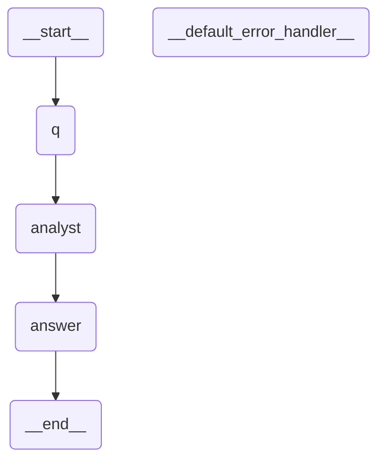

# The MCP layer

**Your LLM composes. This server is the ground truth and the artifact factory.**

That inversion is the design. A "workflow server" usually means *we host your
workflows*. Here the core loop is stateless and model-free: a client asks what
can be composed, composes a document with its own model, and asks for a
verdict. Valid documents come back as committable artifacts. Nothing is stored,
no model is called, and a deployment can serve that entire loop **with no
provider key at all**.

The decision record — trust boundary, transports, honest limits — is
[`decisions/mcp-layer.md`](decisions/mcp-layer.md). This page is the worked
example the record does not contain.

Sections 1–7 below are all one direction: openstategraph running *as* an MCP
server. §8 is the other direction — a workflow *consuming* someone else's MCP
server from the canvas — because both live under "MCP" and only one of them
is this server.

---

## 1. Point a client at it

The server is a Python module. stdio is the default because that is what a
local MCP client spawns.

`claude_desktop_config.json`, Cursor's `mcp.json`, or any client using the
`mcpServers` shape:

```json
{
  "mcpServers": {
    "openstategraph": {
      "command": "python3",
      "args": ["-m", "openstategraph.mcp_server"],
      "env": {
        "PYTHONPATH": "/path/to/openstategraph/backend",
        "OPENSTATEGRAPH_MCP_ALLOW_RUNS": "0"
      }
    }
  }
}
```

`PYTHONPATH` is how you point at a checkout without installing anything (there
is no PyPI wheel yet — see [Using OpenStateGraph in your project](adoption.md)).
If you ran `pip install -e /path/to/openstategraph/backend`, drop the
`PYTHONPATH` line — but keep the rest of the `env` block. Only `PYTHONPATH` is
install-dependent; dropping the whole block also drops
`OPENSTATEGRAPH_MCP_ALLOW_RUNS=0` and silently re-enables the one tool that
spends money.

`OPENSTATEGRAPH_MCP_ALLOW_RUNS=0` removes `run_workflow` from the registry —
the only tool that reaches a model. The other eight stay fully functional,
which is the whole point of keeping validate and compile deterministic.

For a shared server deployment:

```bash
OPENSTATEGRAPH_API_TOKEN=$(openssl rand -hex 32) \
OPENSTATEGRAPH_MCP_TRANSPORT=streamable-http python -m openstategraph.mcp_server
```

**Set `OPENSTATEGRAPH_API_TOKEN`.** With it, `streamable-http` is wrapped in
the same `TokenGate` the HTTP API uses, and every request needs the bearer
token. Without it the server starts anyway and **logs a warning that it is
listening with no authentication** — a deliberate choice, so a local
experiment costs nothing and a shared deployment cannot be unauthenticated by
accident *and* by silence.

A token is not a substitute for a network boundary. `deploy/Caddyfile` and
`deploy/nginx.conf` are committed for terminating TLS in front of it; see
`docs/deploying.md`.

---

## 2. A real session

> **User, to their own client:** *build me a workflow that answers questions
> about our orders SQLite*

### Step 1 — `get_node_vocabulary()`, always first

The client's model cannot invent our node types or port ids, so the server's
instructions make this the mandatory first call. The payload is
machine-readable and assembled from three existing sources of truth (the
**generated** node catalogue `compile/port_specs.json`, the Architect's
known-types set, and the Python ladder classes' locked prompt sections) — it
declares nothing of its own. The port table is emitted from the authoritative
TypeScript definitions by `npm run generate:ports` and CI fails on drift, so a
node type added in the editor cannot go missing here.

The gist of what comes back:

```jsonc
{
  "node_types": [
    {
      "type": "agent.llm",
      "ports": [
        { "id": "feedback", "type": "feedback", "direction": "in" },
        { "id": "prompt",   "type": "text",     "direction": "in" },
        { "id": "result",   "type": "result",   "direction": "out" },
        { "id": "skill",    "type": "skill",    "direction": "in" },
        { "id": "tools",    "type": "tool",     "direction": "in" }
      ],
      "prompt_contract": {
        "preamble": "",
        "contract": "",
        "editable": "Only your own rules are editable. The preamble and the output contract are supplied by the runtime and must NOT be restated in the node's config — the contract is appended last and later instructions win. An EMPTY preamble/contract means this node type locks nothing: its prompt is entirely yours."
      }
    }
    // …and the rest. The grammar: annotate.group, annotate.note,
    //  function.format_report, guard.policy, human.approval, input.markdown,
    //  input.skill, input.text, memory.segment, orchestrate.supervisor,
    //  orchestrate.worker, output.formatted, route.classifier, route.grader,
    //  workflow.subgraph.
    //
    //  Then every bindable tool, which is the half that matters when you are
    //  composing a document an agent can actually run: tool.chinook-execute-sql,
    //  tool.chinook-get-all-tables, tool.chinook-get-schema, tool.email-send,
    //  tool.knowledge-lookup, tool.mcp, tool.platform-describe-workflow,
    //  tool.platform-grep, tool.platform-list-workflows, tool.platform-ls,
    //  tool.platform-read-file, tool.reddit-search, tool.session-identity,
    //  tool.sql-get-schema,
    //  tool.sql-list-tables, tool.sql-query, tool.validate-workflow,
    //  tool.web-fetch, tool.web-search, tool.youtube-transcript.
    //
    //  The list is read from the same registry the runtime binds from — which
    //  is what §7 means by "cannot drift" — and `backend/tests/test_mcp_server.py`
    //  fails if this enumeration and that registry disagree in either
    //  direction. No total is printed here on purpose: a count is the half of
    //  this that rots silently, and the names are the half that matters.
    //  Enumerating the tools rather than eliding them is the point: a tool
    //  absent from this payload is a tool no agent can be wired to.
  ],
  "dynamic_type_prefixes": {
    "tool.": "a tool node; the suffix names a tool discovered in the workflow package's tools/ folder",
    "function.": "a function node; the suffix names a callable in the workflow package's functions/ folder"
  },
  "port_semantics": {
    "control": ["result", "text"],
    "binding": ["skill", "tool"],
    "worker": "worker",
    "feedback": "feedback",
    "explanation": "NOT every edge is a graph edge. An edge landing on a `tool` or `skill` port is a BINDING …"
  },
  "document_shape": { "version": 2, "name": "…", "nodes": [], "edges": [] },
  "rules": [
    "Exactly one node should have no incoming control edge — that is the entry point.",
    "Some node must flow toward the end, or the graph has no exit.",
    "Call compile_workflow after every revision. A document you have not compiled is a guess.",
    "Do not put Infinity or NaN anywhere: this document is JSON."
  ]
}
```

The single most valuable line in that payload is the one about bindings.
**Not every edge is a graph edge.** A tool wired into `tools` is a capability
the agent may call; the same tool wired into `prompt` becomes a graph step that
runs once, on its own, before the agent ever calls it. Both compile. Only one
is what you meant — and §4 shows how the returned Mermaid gives it away.

### Step 2 — the model's first attempt

It invents an output node type:

```json
{
  "nodes": [{ "id": "answer", "type": "output.text", "data": {} }]
}
```

### Step 3 — `compile_workflow(document)` refuses

```json
{
  "validated": false,
  "findings": ["unknown node type 'output.text' on 'answer'"],
  "document": null,
  "mermaid": "",
  "warnings": [],
  "run_snippet": "",
  "package_skeleton": []
}
```

No artifacts, a finding naming the node by id, and nothing written anywhere.
**That loop is the product**: the client's model iterates against deterministic
compiler evidence instead of its own confidence. The compile is cheap and calls
no model, so running it after every revision costs nothing.

### Step 4 — the corrected document

The model reads `node_types`, swaps `output.text` for `output.formatted`, and
wires the SQL tool into the agent's `tools` bus rather than into control flow:

```json
{
  "version": 2,
  "name": "Orders Q&A",
  "nodes": [
    {
      "id": "q",
      "type": "input.text",
      "title": "Question",
      "data": {},
      "position": { "x": 0, "y": 120 }
    },
    {
      "id": "sql",
      "type": "tool.orders_sql",
      "title": "Orders SQL",
      "data": {},
      "position": { "x": 240, "y": 260 }
    },
    {
      "id": "analyst",
      "type": "agent.llm",
      "title": "Orders analyst",
      "data": {
        "instruction": "Answer questions about the orders database. Inspect the schema before writing SQL, and quote the numbers you queried."
      },
      "position": { "x": 480, "y": 120 }
    },
    {
      "id": "answer",
      "type": "output.formatted",
      "title": "Answer",
      "data": {},
      "position": { "x": 760, "y": 120 }
    }
  ],
  "edges": [
    {
      "source": { "nodeId": "q", "portId": "text" },
      "target": { "nodeId": "analyst", "portId": "prompt" }
    },
    {
      "source": { "nodeId": "sql", "portId": "tool" },
      "target": { "nodeId": "analyst", "portId": "tools" }
    },
    {
      "source": { "nodeId": "analyst", "portId": "result" },
      "target": { "nodeId": "answer", "portId": "result" }
    }
  ]
}
```

Four nodes, three edges — two of which are control flow and one of which is a
binding. This exact document was run through the real
`WorkflowArtifacts.compile` to produce everything below; it is not illustrative
JSON.

---

## 3. What `compile_workflow` gives back

Seven fields, always the same seven whether the verdict is yes or no:

| Field | On success | On refusal |
| --- | --- | --- |
| `validated` | `true` | `false` |
| `findings` | `[]` | the reasons — fix these |
| `document` | the normalized `workflow.json` envelope | `null` |
| `mermaid` | the topology the compiler actually produced | `""` |
| `warnings` | capabilities it could not resolve here | `[]` |
| `run_snippet` | how to run it without this editor | `""` |
| `package_skeleton` | the full package layout | `[]` |

For the document above:

```json
{
  "validated": true,
  "findings": [],
  "warnings": [
    "No implementation for tool \"tool.orders_sql\" — the agent ran without it, so its answer may not be grounded in that data source."
  ],
  "package_skeleton": [
    "workflow.json",
    "AGENTS.md",
    "tools/",
    "functions/",
    "middlewares/",
    "skills/",
    "knowledge/",
    "tests/",
    "data/"
  ]
}
```

**`warnings` is not `findings`, and you must read it anyway.** The graph is
valid; the tool it names is not resolvable from a stateless compile, because
`tool.orders_sql` lives in a package's `tools/` folder that this call never
sees. That is the honest difference between *"your graph compiles"* and
*"your graph will be fully capable when it runs"*. Writing
`workflows/orders/tools/orders_sql.py` — a `BaseTool` subclass — is the
remaining work, and the warning is what tells the client's model to say so
rather than declaring victory.

`document` is the envelope to commit:

```json
{
  "version": 1,
  "name": "Orders Q&A",
  "savedAt": "2026-08-10T07:30:17.224390+00:00",
  "published": false,
  "document": { "version": 2, "name": "Orders Q&A", "nodes": [], "edges": [] }
}
```

`published: false` is not a placeholder. **A machine never publishes.** What a
client commits is a draft; a human flips the flag in the editor, having looked
at the graph.

`run_snippet` is returned verbatim, and it is honest about both paths:

```python
# The compiled output is a plain LangGraph StateGraph: it runs
# anywhere Python runs, with or without the OpenStateGraph editor.
#
# In-process — point it at the package FOLDER (the one holding
# workflow.json), so its tools/, functions/ and skills/ are wired
# too. Compiling the document by hand skips exactly that, and an
# agent that lost its tools answers from memory instead of failing.
from openstategraph import load_workflow

workflow = load_workflow("workflows/my-workflow")
if workflow.warnings:
    print("degraded:", workflow.warnings)
print(workflow.ask("..."))

# workflow.graph is the compiled LangGraph object — stream it,
# checkpoint it, mount it in your own service.

# Or against a running OpenStateGraph server:
#   POST /api/runs  {"workflow": <the document>, "question": "..."}
```

---

## 4. The LLM draws the graph — on your machine

`mermaid` is not a picture of the document. It is
`compiled.get_graph(xray=True).draw_mermaid()` — the topology the compiler
*actually produced*, so a preview can never be a hand-drawn approximation that
drifts. It does **not** open a mount or an agent here: those compile to closures
rather than LangGraph subgraphs, so `xray` has nothing to expand, and this tool
is stateless besides — it holds no workflow library, so a mounted child does
not resolve at all and one flat box is the true picture of what would compile.
(`run_workflow` is the other case: it ran the children, so its `mermaid` opens
every mount as a `subgraph` block.) Text, never a PNG:
`draw_mermaid_png()` would post your graph to a third-party API.

Here is the real output for the document above:

````text

````

MCP clients like Claude render a fenced `mermaid` block **as a diagram**. So
the user asks for a workflow in a chat window and gets a picture of the
compiled StateGraph back — drawn locally, from compiler output, with the graph
never leaving the machine. That is literally *the LLM draws the graph locally*,
and it costs us nothing: we return text a client already knows how to render.

**Read the picture, not just the verdict.** Note which nodes appear: `q`,
`analyst`, `answer` — and *not* `sql`. The tool is a binding, so it is a
capability of `analyst`, not a step. Had the model wired `sql` into `prompt`
instead, the same document would still compile, and the Mermaid would show:

```text
	q --> sql;
	sql --> analyst;
```

A `sql` box in the flow is the tell that a capability was miswired as control
flow — the tool would run once on its own, and then the agent would call it
again. The diagram catches what the verdict cannot.

---

## 5. Where the artifacts go

Into **your** repository. `compile_workflow` saves nothing.

```
your-repo/
└── workflows/orders/
    ├── workflow.json     ← the returned `document` envelope
    ├── AGENTS.md
    ├── tools/orders_sql.py   ← the warning in §3 is asking for this
    ├── knowledge/
    └── tests/
```

`save_workflow_draft(slug, name, document)` exists for deployments that also
*host* workflows, and it is optional — the primary flow keeps the artifact in
your repo. When you do use it, the guardrails are server-side, not on the
client's honour: the document is validated first and an invalid one is refused
with findings rather than written (there is no `force`), the write is always a
draft, and a published workflow is never overwritten.

**Pass `slug=None` for a new workflow.** The server mints a free slug from
`name` and the response says which one it got — the first "My Workflow" gets
`my-workflow`, a second gets `my-workflow-<six characters>`. A slug you derive
from a name yourself is a guess, and a guess that lands on an existing draft
replaces it; name a slug only to update a package you saved earlier.

---

## 6. The trust boundary, in one list

Enforced in code, pinned by a test that asserts the registered tool names equal
`EXPOSED_TOOLS` exactly and that no tool name contains publish, delete,
credential, secret or key:

1. **No publish tool exists.** A human flips the flag in the editor.
2. **No delete tool exists.** MCP cannot remove a workflow.
3. **No credentials cross the wire.** `run_workflow` takes no credentials
   parameter; the model resolves from the server's own environment.
4. **Writes are validated server-side.** The library can never accumulate
   documents that do not compile.
5. **A published workflow is never overwritten** — including the back-compat
   case where a missing `published` flag means published.
6. **Writes are jailed to `workflows/`.** Any slug that escapes the root is
   rejected.
7. **`recursion_limit` is bounded server-side** (200). It counts *supersteps,
   not iterations*, so an unbounded value from an untrusted client is a
   denial-of-service knob.

The nine exposed tools: `get_node_vocabulary`, `compile_workflow`,
`validate_workflow`, `list_workflows`, `describe_workflow`, `get_knowledge`,
`export_plugin`, `save_workflow_draft`, `run_workflow`.

## 7. Limits worth knowing before you deploy it

- **Authentication is one shared token, and it is off by default.**
  `OPENSTATEGRAPH_API_TOKEN` gates the `streamable-http` transport through the
  same `TokenGate` as the HTTP API; unset, the server warns and serves anyone.
  One token means every connected client has the *same* capabilities — there
  are no per-client scopes — so the reverse proxy is still where you draw a
  boundary between different callers. `docs/decisions/mcp-layer.md` records why
  a token earns its place rather than deferring entirely to the deployer.
- **Compile is stateless**, so a `workflow.subgraph` naming
  a hosted child, or an agent bound to a package-local tool, resolves to
  nothing. Valid topology, real capability gap — it comes back as a `warning`,
  never silently.
- **`run_workflow` is synchronous and unstreamed.** No token streaming, and no
  resume *tool*. A `human.approval` node does now pause properly — the run
  compiles against the same durable checkpointer the HTTP API uses — and
  `run_workflow` returns an `error` naming the paused `thread_id` rather than a
  blank answer. Continue it with `/api/runs/resume` or the editor.
- **No rate limiting, quotas or audit log.** `run_workflow` in particular
  spends the deployer's model budget.
- **Discovered `tool.*`/`function.*` node types are not enumerable.** They are
  minted per workflow package at runtime, so the vocabulary names the prefixes
  and their meaning rather than listing them. Everything the editor itself
  ships — including workflow-scoped tool families — is generated into the
  catalogue and cannot drift (RC-01, closed).

All of these, with reasoning and re-open conditions, are in
[`decisions/mcp-layer.md`](decisions/mcp-layer.md).

## 8. The other direction — connecting to someone else's MCP server

Everything above is about openstategraph running *as* an MCP server. `tool.mcp`
is the reverse: a workflow node that connects *to* one, so an agent on the
canvas can call its tools.

One `tool.mcp` card carries **N server rows**, not one server per card — URL,
transport, auth, and a per-row tool filter, the same field set the app-level
MCP panel renders. Rows are addressable: a row that is unreachable, rejects
its credential, or does not speak MCP degrades to a capability warning naming
which row, and every other row still binds.

N rows on one card is not free, though — it costs per-server **routing**,
because the card has exactly one output and every row's tools travel to
whatever that output feeds. Whether that cost is zero or a wall depends on who
is downstream, and the card says so in its own copy rather than leaving it for
a support thread:

> One node per group of servers that share a consumer. Every row’s tools land on the same bus, so an agent wired here can call all of them and choose per task; two agents that need different servers want two of these nodes. Narrow a thirty-tool server with that row’s own filter rather than by splitting it out.

That is `MCP_GROUPING_GUIDE` in `src/nodes/tools/mcpServerFields.ts`, quoted
here rather than restated so the two copies cannot drift apart — a test pins
the quote (`src/nodes/tools/mcpDocsGuide.test.ts`).
