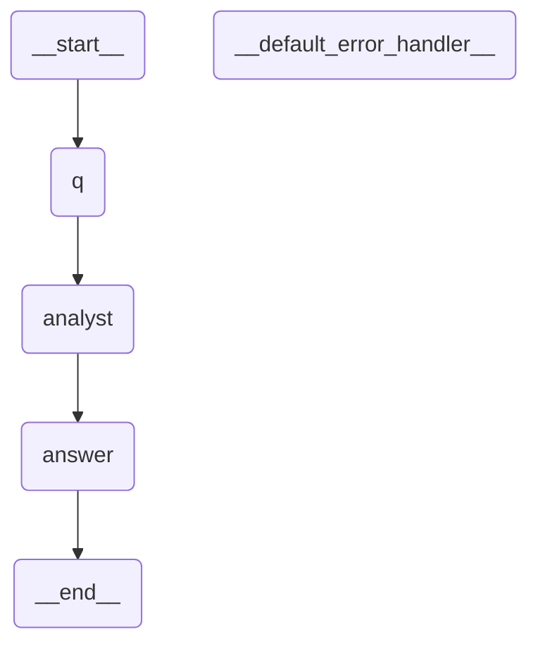

# The MCP layer

**Your LLM composes. This server is the ground truth and the artifact factory.**

That inversion is the design. A "workflow server" usually means *we host your
workflows*. Here the core loop is stateless and model-free: a client asks what
can be composed, composes a document with its own model, and asks for a
verdict. Valid documents come back as committable artifacts. Nothing is stored,
no model is called, and a deployment can serve that entire loop **with no
provider key at all**.

The decision record — trust boundary, transports, honest limits — is
[`decisions/mcp-layer.md`](decisions/mcp-layer.md). This page is the worked
example the record does not contain.

Sections 1–7 below are all one direction: openstategraph running *as* an MCP
server. §8 is the other direction — a workflow *consuming* someone else's MCP
server from the canvas — because both live under "MCP" and only one of them
is this server.

---

## 1. Point a client at it

The server is a Python module. stdio is the default because that is what a
local MCP client spawns. It needs the `[mcp]` extra — already included if you
installed `[server]` (`"openstategraph[server,<provider>]"` is enough for
both the editor and `openstategraph mcp`); install `[mcp]` on its own if you
want the MCP transport with no web server at all.

`init` also installs the skill your agent reads once the server is selected —
the routing check, the interview, the board loop and the rules it must read
before composing anything. [The OpenStateGraph skill](the-openstategraph-skill.md)
is the reader's page for it.

**You do not paste this block any more — `openstategraph init` writes it.**
Four agents read four different files for a project-local stdio server, and
`init` renders all four from one descriptor:

| File | Agent | Key |
| --- | --- | --- |
| `.mcp.json` | Claude Code | `mcpServers` |
| `.vscode/mcp.json` | VS Code, GitHub Copilot | `servers` |
| `.cursor/mcp.json` | Cursor | `mcpServers` |
| `.codex/config.toml` | OpenAI Codex CLI | `[mcp_servers.openstategraph]` |

What it writes into each, in the `mcpServers` spelling:

```json
{
  "mcpServers": {
    "openstategraph": {
      "command": "openstategraph",
      "args": ["mcp"],
      "env": {
        "OPENSTATEGRAPH_MCP_ALLOW_RUNS": "0"
      }
    }
  }
}
```

`command` is the console script the wheel installs, so nothing in the block is
install-dependent — no `PYTHONPATH`, nothing naming a checkout. Working from a
checkout with nothing installed is the one case that still needs a hand-written
entry: `"command": "python3"`, `"args": ["-m", "openstategraph.mcp_server"]`,
and `"PYTHONPATH": "/path/to/openstategraph/backend"` beside the variable
below. Keep the rest of the `env` block whichever spelling you use.

An existing file is merged into rather than replaced: other servers and unknown
keys survive, and a file we cannot parse — or an `openstategraph` entry of
yours that differs from ours — is left exactly as it is and reported as `kept`.
[`cli.md`](cli.md#init) has the states.

**To enable runs**, set `OPENSTATEGRAPH_MCP_ALLOW_RUNS=1` in that `env` block
by hand. That edit is the thing `init` will not undo: on the next run it sees
an entry that differs from what it would write, keeps yours, and says so.

`OPENSTATEGRAPH_MCP_ALLOW_RUNS=0` removes `run_workflow` from the registry —
the only tool that reaches a model. Every other tool stays fully functional,
which is the whole point of keeping validate and compile deterministic. (No
count here, for the reason §2's own vocabulary listing gives: a total is the
half that rots silently. §6 names them.)

For a shared server deployment:

```bash
OPENSTATEGRAPH_API_TOKEN=$(openssl rand -hex 32) \
OPENSTATEGRAPH_MCP_TRANSPORT=streamable-http python -m openstategraph.mcp_server
```

**Set `OPENSTATEGRAPH_API_TOKEN`.** With it, `streamable-http` is wrapped in
the same `TokenGate` the HTTP API uses, and every request needs the bearer
token. Without it the server starts anyway and **logs a warning that it is
listening with no authentication** — a deliberate choice, so a local
experiment costs nothing and a shared deployment cannot be unauthenticated by
accident *and* by silence.

A token is not a substitute for a network boundary. `deploy/Caddyfile` and
`deploy/nginx.conf` are committed for terminating TLS in front of it; see
`docs/deploying.md`.

---

## 2. A real session

> **User, to their own client:** *build me a workflow that answers questions
> about our orders SQLite*

### Step 1 — `get_node_vocabulary()`, always first

Beside it, once: `get_engineering_rules()`. The vocabulary says what exists;
the rules say what may legally be built out of it — the
interface/abstract/base/concrete ladder, extension by registration, port
cardinality, one field schema, tests first, and the rule that decides most
arguments: *never invent a node type the registry does not know*. Making a
new one is fine, through the family's base and registered first. It answers
`{"version", "rules"}`, versioned with the installed package because they are
the rules of the release the caller actually has; it is deterministic, calls
no model, and stays open on a deployment with runs closed.

The client's model cannot invent our node types or port ids, so the server's
instructions make this the mandatory first call. The payload is
machine-readable and assembled from three existing sources of truth (the
**generated** node catalogue `compile/port_specs.json`, the Architect's
known-types set, and the Python ladder classes' locked prompt sections) — it
declares nothing of its own. The port table is emitted from the authoritative
TypeScript definitions by `npm run generate:ports` and CI fails on drift, so a
node type added in the editor cannot go missing here.

The gist of what comes back:

```jsonc
{
  "node_types": [
    {
      "type": "agent.llm",
      "ports": [
        { "id": "feedback", "type": "feedback", "direction": "in" },
        { "id": "prompt",   "type": "text",     "direction": "in" },
        { "id": "result",   "type": "result",   "direction": "out" },
        { "id": "skill",    "type": "skill",    "direction": "in" },
        { "id": "tools",    "type": "tool",     "direction": "in" }
      ],
      // Every entry also carries `fields` — the config schema, derived from the
      // same declaration the editor's card renders from — plus `executes`,
      // `scope` and `generated_ports`. `fields` is the list the fifth rule
      // below tells you to read before setting anything in `data`:
      "fields": [
        { "key": "model", "kind": "select", "label": "Model", "required": false, "default": "" },
        { "key": "systemPrompt", "kind": "textarea", "label": "System prompt", "required": false, "default": "" }
        // …and the rest.
      ],
      "prompt_contract": {
        "preamble": "",
        "contract": "",
        "default_rules": "- Answer the question that was asked, and stop there.\n- Where you hold a tool that can establish a fact, use it. …",
        "editable": "Only your own rules are editable. The preamble and the output contract are supplied by the runtime and must NOT be restated in the node's config — the contract is appended last and later instructions win. An empty preamble/contract does NOT mean the prompt is entirely yours: default_rules is prepended by the base and your rules extend it unless you replace them."
      }
    }
    // …and the rest. The grammar: annotate.group, annotate.note,
    //  function.format_report, guard.check, guard.policy, human.approval, input.markdown,
    //  input.skill, input.text, memory.segment, orchestrate.supervisor,
    //  orchestrate.worker, output.formatted, resolve.source, resolve.vocabulary,
    //  route.classifier, route.grader, workflow.subgraph.
    //
    //  Then every bindable tool, which is the half that matters when you are
    //  composing a document an agent can actually run: tool.chinook-execute-sql,
    //  tool.chinook-get-all-tables, tool.chinook-get-schema, tool.email-send,
    //  tool.knowledge-lookup, tool.mcp, tool.platform-describe-workflow,
    //  tool.platform-grep, tool.platform-list-workflows, tool.platform-ls,
    //  tool.platform-read-file, tool.reddit-search, tool.session-identity,
    //  tool.sql-get-schema,
    //  tool.sql-list-tables, tool.sql-query, tool.validate-workflow,
    //  tool.web-fetch, tool.web-search, tool.youtube-transcript.
    //
    //  The list is read from the same registry the runtime binds from — which
    //  is what §7 means by "cannot drift" — and `backend/tests/test_mcp_server.py`
    //  fails if this enumeration and that registry disagree in either
    //  direction. No total is printed here on purpose: a count is the half of
    //  this that rots silently, and the names are the half that matters.
    //  Enumerating the tools rather than eliding them is the point: a tool
    //  absent from this payload is a tool no agent can be wired to.
  ],
  "dynamic_type_prefixes": {
    "tool.": "a tool node; the suffix names a tool discovered in the workflow package's tools/ folder",
    "function.": "a function node; the suffix names a callable in the workflow package's functions/ folder"
  },
  "port_semantics": {
    "control": ["result", "text"],
    "binding": ["skill", "tool"],
    "worker": "worker",
    "feedback": "feedback",
    "explanation": "NOT every edge is a graph edge. An edge landing on a `tool` or `skill` port is a BINDING …"
  },
  "document_shape": { "version": 2, "name": "…", "nodes": [], "edges": [] },
  "rules": [
    "Exactly one node should have no incoming control edge — that is the entry point.",
    "Some node must flow toward the end, or the graph has no exit.",
    "Call compile_workflow after every revision. A document you have not compiled is a guess.",
    "Do not put Infinity or NaN anywhere: this document is JSON.",
    "A node's `data` keys are exactly its `fields` list above — check that list before setting any key. compile_workflow does not currently reject an unrecognised or missing required key by itself; guessing produces a document that may still validate while the node silently lacks what it needs to run."
  ]
}
```

The single most valuable line in that payload is the one about bindings.
**Not every edge is a graph edge.** A tool wired into `tools` is a capability
the agent may call; the same tool wired into `prompt` becomes a graph step that
runs once, on its own, before the agent ever calls it. Both compile. Only one
is what you meant — and §4 shows how the returned Mermaid gives it away.

### Step 2 — the model's first attempt

It invents an output node type:

```json
{
  "nodes": [{ "id": "answer", "type": "output.text", "data": {} }]
}
```

### Step 3 — `compile_workflow(document)` refuses

```json
{
  "validated": false,
  "findings": ["unknown node type 'output.text' on 'answer'"],
  "document": null,
  "mermaid": "",
  "warnings": [],
  "run_snippet": "",
  "package_skeleton": []
}
```

No artifacts, a finding naming the node by id, and nothing written anywhere.
**That loop is the product**: the client's model iterates against deterministic
compiler evidence instead of its own confidence. The compile is cheap and calls
no model, so running it after every revision costs nothing.

### Step 4 — the corrected document

The model reads `node_types`, swaps `output.text` for `output.formatted`, and
wires the SQL tool into the agent's `tools` bus rather than into control flow:

```json
{
  "version": 2,
  "name": "Orders Q&A",
  "nodes": [
    {
      "id": "q",
      "type": "input.text",
      "title": "Question",
      "data": {},
      "position": { "x": 0, "y": 120 }
    },
    {
      "id": "sql",
      "type": "tool.orders_sql",
      "title": "Orders SQL",
      "data": {},
      "position": { "x": 240, "y": 260 }
    },
    {
      "id": "analyst",
      "type": "agent.llm",
      "title": "Orders analyst",
      "data": {
        "instruction": "Answer questions about the orders database. Inspect the schema before writing SQL, and quote the numbers you queried."
      },
      "position": { "x": 480, "y": 120 }
    },
    {
      "id": "answer",
      "type": "output.formatted",
      "title": "Answer",
      "data": {},
      "position": { "x": 760, "y": 120 }
    }
  ],
  "edges": [
    {
      "source": { "nodeId": "q", "portId": "text" },
      "target": { "nodeId": "analyst", "portId": "prompt" }
    },
    {
      "source": { "nodeId": "sql", "portId": "tool" },
      "target": { "nodeId": "analyst", "portId": "tools" }
    },
    {
      "source": { "nodeId": "analyst", "portId": "result" },
      "target": { "nodeId": "answer", "portId": "result" }
    }
  ]
}
```

Four nodes, three edges — two of which are control flow and one of which is a
binding. This exact document was run through the real
`WorkflowArtifacts.compile` to produce everything below; it is not illustrative
JSON.

---

## 3. What `compile_workflow` gives back

Seven fields, always the same seven whether the verdict is yes or no:

| Field | On success | On refusal |
| --- | --- | --- |
| `validated` | `true` | `false` |
| `findings` | `[]` | the reasons — fix these |
| `document` | the normalized `workflow.json` envelope | `null` |
| `mermaid` | the topology the compiler actually produced | `""` |
| `warnings` | capabilities it could not resolve here | `[]` |
| `run_snippet` | how to run it without this editor | `""` |
| `package_skeleton` | the full package layout | `[]` |

For the document above:

```json
{
  "validated": true,
  "findings": [],
  "warnings": [
    "No implementation for tool \"tool.orders_sql\" — the agent ran without it, so its answer may not be grounded in that data source."
  ],
  "package_skeleton": [
    "workflow.json",
    "AGENTS.md",
    "tools/",
    "functions/",
    "middlewares/",
    "skills/",
    "knowledge/",
    "tests/",
    "data/"
  ]
}
```

**`warnings` is not `findings`, and you must read it anyway.** The graph is
valid; the tool it names is not resolvable from a stateless compile, because
`tool.orders_sql` lives in a package's `tools/` folder that this call never
sees. That is the honest difference between *"your graph compiles"* and
*"your graph will be fully capable when it runs"*. Writing
`workflows/orders/tools/orders_sql.py` — a `BaseTool` subclass — is the
remaining work, and the warning is what tells the client's model to say so
rather than declaring victory.

`document` is the envelope to commit:

```json
{
  "version": 1,
  "name": "Orders Q&A",
  "savedAt": "2026-08-10T07:30:17.224390+00:00",
  "published": false,
  "document": { "version": 2, "name": "Orders Q&A", "nodes": [], "edges": [] }
}
```

`published: false` is not a placeholder. **A machine never publishes.** What a
client commits is a draft; a human flips the flag in the editor, having looked
at the graph.

`run_snippet` is returned verbatim, and it is honest about both paths:

```python
# The compiled output is a plain LangGraph StateGraph: it runs
# anywhere Python runs, with or without the OpenStateGraph editor.
#
# In-process — point it at the package FOLDER (the one holding
# workflow.json), so its tools/, functions/ and skills/ are wired
# too. Compiling the document by hand skips exactly that, and an
# agent that lost its tools answers from memory instead of failing.
from openstategraph import load_workflow

workflow = load_workflow("workflows/my-workflow")
if workflow.warnings:
    print("degraded:", workflow.warnings)
print(workflow.ask("..."))

# workflow.graph is the compiled LangGraph object — stream it,
# checkpoint it, mount it in your own service.

# Or against a running OpenStateGraph server:
#   POST /api/runs  {"workflow": <the document>, "question": "..."}
```

---

## 4. The LLM draws the graph — on your machine

`mermaid` is not a picture of the document. It is
`compiled.get_graph(xray=True).draw_mermaid()` — the topology the compiler
*actually produced*, so a preview can never be a hand-drawn approximation that
drifts. It does **not** open a mount or an agent here: those compile to closures
rather than LangGraph subgraphs, so `xray` has nothing to expand, and this tool
is stateless besides — it holds no workflow library, so a mounted child does
not resolve at all and one flat box is the true picture of what would compile.
(`run_workflow` is the other case: it ran the children, so its `mermaid` opens
every mount as a `subgraph` block.) Text, never a PNG:
`draw_mermaid_png()` would post your graph to a third-party API.

Here is the real output for the document above:

````text

````

MCP clients like Claude render a fenced `mermaid` block **as a diagram**. So
the user asks for a workflow in a chat window and gets a picture of the
compiled StateGraph back — drawn locally, from compiler output, with the graph
never leaving the machine. That is literally *the LLM draws the graph locally*,
and it costs us nothing: we return text a client already knows how to render.

**Read the picture, not just the verdict.** Note which nodes appear: `q`,
`analyst`, `answer` — and *not* `sql`. The tool is a binding, so it is a
capability of `analyst`, not a step. Had the model wired `sql` into `prompt`
instead, the same document would still compile, and the Mermaid would show:

```text
	q --> sql;
	sql --> analyst;
```

A `sql` box in the flow is the tell that a capability was miswired as control
flow — the tool would run once on its own, and then the agent would call it
again. The diagram catches what the verdict cannot.

---

## 5. Where the artifacts go

Into **your** repository. `compile_workflow` saves nothing.

```
your-repo/
└── workflows/orders/
    ├── workflow.json     ← the returned `document` envelope
    ├── AGENTS.md
    ├── tools/orders_sql.py   ← the warning in §3 is asking for this
    ├── knowledge/
    └── tests/
```

`save_workflow_draft(slug, document, name=None)` exists for deployments that also
*host* workflows, and it is optional — the primary flow keeps the artifact in
your repo. Note the order: `document` is the second argument and `name` the
third and optional one, because `document` accepts `compile_workflow`'s own
envelope and the server reads the name out of it. When you do use it, the guardrails are server-side, not on the
client's honour: the document is validated first and an invalid one is refused
with findings rather than written (there is no `force`), the write is always a
draft, and a published workflow is never overwritten.

**Pass `slug=None` for a new workflow.** The server mints a free slug from
`name` and the response says which one it got — the first "My Workflow" gets
`my-workflow`, a second gets `my-workflow-2`. A slug you derive
from a name yourself is a guess, and a guess that lands on an existing draft
replaces it; name a slug only to update a package you saved earlier.

---

## 5a. The kanban door — the board, and one card on it

`kanban_list_cards(board, column, area, priority)`,
`kanban_attend_card(task_id, actor)`, `kanban_set_stage(task_id, stage, actor,
test_id, reason, commit)`, `kanban_show_card(task_id)`,
`kanban_release_card(task_id, threshold_seconds)`,
`kanban_answer_card(task_id, answer, actor)`,
`kanban_file_card(kind, title, story, done_when, priority, priority_reason,
area, blocked_by, agent_model, agent_effort, actor)`,
`kanban_triage(board)` — the MCP half of
`kanban-patrol/19`'s card lifecycle, beside a CLI door (`openstategraph kanban
file|attend|stage|answer|show|release`) for an agent that is not MCP-attached
to this project's server. Both wrap the identical function; there is no second
implementation of the claim or ordering logic to drift out of sync with this
one.

The order these are called in — triage, attend, red, green, finished — is the
build loop in [the OpenStateGraph skill](the-openstategraph-skill.md), which is
the document a coding agent follows when it uses them.

`kanban_list_cards` is where an agent arriving cold starts: every other tool
here takes a `task_id` you must already know. It answers `{"ok": true,
"cards": [...]}`, each row carrying exactly the fields
`GET /api/kanban/cards` sends the board — one shape, built by one function,
so an agent and a person are never reading two different cards — plus the
derived `column`.

The four columns are `detected`, `needsYou`, `inProgress` and `resolved`, and
the column is **derived from stage and kind, never stored**, so it cannot
disagree with the card it describes: a claimed card is `inProgress` whatever
its kind, a card that carried a test from red to green is `resolved`, and only
an unattended card is placed by its kind. **Take work from `detected`.** A
card in `needsYou` is a judgement — a `prototype`, a `grilling`, a `decision`
— and is the owner's to settle, not an agent's. Once it is settled it leaves
that column: an **answered** judgement is `detected`, carrying the decision
(`kanban_answer_card` below).

All four filters are exact, case-insensitive, and combine. A value outside the
accepted set answers `{"ok": false, "cards": [], "reason": "..."}` naming what
is accepted — never an exception over the transport, and never a bare empty
list, which would read as "the board is empty" and be a different, wrong fact.
`board` is the one filter with no accepted set to check against, because a
board name is whatever a project called one. A project where nothing has ever
been filed answers `ok: true` with no cards.

`kanban_attend_card` is the exclusive claim — first caller wins. A second
call on an already-attended card returns `{"ok": false, "reason": "..."}`
naming who has it; it never raises and never silently overwrites. `stage` is
one of `red`, `green`, `finished`, and only ever advances one step at a
time — skipping a stage is reported the same way, as a structured refusal a
client's model can read, not a stack trace over the transport.

Each stage is also a sentence on the board (`kanban-patrol/19`), so a reader
sees how far a card has got rather than only that somebody has it — the copy
is owned once, in `src/view/board/cardStage.ts`:

| stage | what the card says |
| --- | --- |
| `attended` | Queued |
| `red` | In progress — test written |
| `green` | In progress — test passing |
| `finished` | Awaiting review |

`finished` reads "Awaiting review" rather than Resolved because it is a
claim: `17`'s evidence gate is the only thing that moves a card into the
Resolved column.

`kanban-patrol/17`+`21`+`33`: `stage` is evidence-gated. `red` needs `test_id`
and `reason`; `green` needs `test_id` and it must match the one recorded at
`red`; `finished` needs red and green already recorded and `test_id` is
optional there, but a supplied one is refused, row unchanged, when it
disagrees with the recorded id — a missing or mismatched piece returns the
same structured `{"ok": false, "reason": "..."}` a skipped stage already
does, never a fresh claim accepted without proof.

`kanban_answer_card` is how a settled judgement gets recorded —
`kanban-patrol/15`, decided 2026-09-04. A `needsYou` card carries a question
the patrol could not answer, and **only a person may answer it**: an agent
that pulled the card asks them and calls this with what they said. Never
choose for them; that the choice was not the agent's to make is the entire
reason the card was in `needsYou`.

The card then returns to `detected` carrying the decision, so the next
`kanban_attend_card` picks it up with the judgement already made, and
`kanban_show_card` prints the decision at the top. It never reaches
`resolved` this way — `17`'s evidence gate is still the only road there.

An answer is **written once**. A blank or whitespace answer, a card that was
never in question (a `bug` is in `detected` because nothing was being asked),
one somebody is already working, and a second answer on a card somebody
already decided are all `{"ok": false, "reason": "..."}` naming which — never
a silent overwrite of somebody else's decision.

`kanban_file_card` is the one tool here that **creates** a card rather than
moving one already on the board (`osg-agent-experience/25`). The patrol files
what it found in the run store, and a reader can go and look at the thread
behind the card; a card filed out of a conversation has no such thread, so the
brief is required rather than defaulted. `story` (the plain-English want),
`done_when` (the check that settles it) and `priority_reason` (why it is that
urgent) are refused blank — an empty string is exactly the shape the lost
conversation would take on the card.

`kind` is `task`, `bug` or `grilling`, and it decides the column the same
derived way everything else here does: a `grilling` ends in a judgement and
lands in `needsYou`, the other two land in `detected`. The id is derived from
the title — `<project_id>:idea-<slug>` — so two ideas given one title are a
refusal rather than a silent merge, and `blocked_by` can name a card by an id
its filer can predict. `agent_model` and `agent_effort` are advisory: what to
give a subagent that takes the card, left empty when nobody had an opinion
rather than filled with a default that would read as somebody's decision.
Every refusal is the same `{"ok": false, "reason": "..."}` shape, including a
project with no `project_id` yet — a card is never filed under an invented
identity (`kanban-patrol/23`).

`kanban_release_card` is the human's explicit press on a card the system has
already flagged stale — "flag, never auto-release" — refused the same
structured way for any card not currently past `threshold_seconds` (default
3600, one hour): an active claim, one nobody has attended, or one already
`finished`, is never releasable by accident. A `finished` card is **never**
stale (`kanban-patrol/32`) — its heartbeat is old because nobody writes to a
resolved card again, and staleness names an abandoned claim, not a
discharged one. A successful release resets stage, actor, heartbeat,
and every evidence field back to a fresh, unattended row.

`kanban_triage(board="workflows")` answers "what first," not "what is here" —
a read-only door needing no principal (`osg-agent-experience/25` slice 4). It
excludes `finished` cards outright, and treats a `blocked_by` naming one as
spent, the same way `kanban_release_card` treats a `finished` card as never
stale. The order: an unblocked card other cards are waiting on, most
dependents first; then an unblocked card nobody is waiting on, by priority
(`high`, `med`, `low`); then every still-blocked card, last, in that same
dependents-then-priority sub-order. Each row is `kanban_list_cards`' own row
plus `rank` (1-indexed) and `why_here`, the one sentence naming which rule
placed it there — `"unblocks 2 cards"`, `"high priority, nothing waits on
it"`, or `"blocked by <ids>"` — so an agent never has to reconstruct the
order from the raw fields to trust it.

### Which name lands on the card

`actor` is a parameter a *model* fills in, and this project's standing rule
is that identity is the server's to determine, never the caller's to assert.
So `kanban_attend_card`, `kanban_set_stage` and `kanban_answer_card` resolve
the caller first, and what they resolve wins (`kanban-patrol/29`). It matters
most on the third: a decision attributed to whoever the model said made it is
not a record of who made it.

- **If this deployment identifies its callers** — `OPENSTATEGRAPH_PRINCIPAL_HEADER`
  names the header your reverse proxy stamps, and the request also carries
  `X-OpenStateGraph-Proxy`, the one header every proxy config in `deploy/`
  sets — then that principal **is** the actor. An `actor` argument that says
  something else is dropped, never merged, and the substitution is logged at
  info so a reader of the logs can see why the card names somebody the client
  did not send. This is the same `IPrincipals` seam `/api/runs` resolves
  through; there is no second identity scheme here.
- **Otherwise the caller's `actor` is written exactly as passed** — which is
  the documented default, since a bare `streamable-http` listener with no
  proxy in front identifies nobody. The transport's own token gate is the
  trust bar there. Refusing instead would make the two writing tools unusable on
  every deployment without a proxy, which is most of them.
- **The identity header alone is not identity.** Without
  `X-OpenStateGraph-Proxy` beside it, it is whatever the client typed, so it
  resolves nobody and the caller's `actor` stands. Same for stdio, which has
  no HTTP request at all.

The `actor` a card can never hold is a blank one: `kanban-patrol/20`'s floor —
"already attended by ____" with nothing in the blank — is refused at the
store, on both doors.

---

## 6. The trust boundary, in one list

Enforced in code, pinned by a test that asserts the registered tool names equal
`EXPOSED_TOOLS` exactly and that no tool name contains publish, delete,
credential, secret or key:

1. **No publish tool exists.** A human flips the flag in the editor.
2. **No delete tool exists.** MCP cannot remove a workflow.
3. **No credentials cross the wire.** `run_workflow` takes no credentials
   parameter; the model resolves from the server's own environment.
4. **Writes are validated server-side.** The library can never accumulate
   documents that do not compile.
5. **A published workflow is never overwritten** — including the back-compat
   case where a missing `published` flag means published.
6. **Writes are jailed to `workflows/`.** Any slug that escapes the root is
   rejected.
7. **`recursion_limit` is bounded server-side** (200). It counts *supersteps,
   not iterations*, so an unbounded value from an untrusted client is a
   denial-of-service knob.

The exposed tools, in `EXPOSED_TOOLS` order. Authoring a workflow:
`get_node_vocabulary`, `get_engineering_rules`, `compile_workflow`, `validate_workflow`,
`list_workflows`, `describe_workflow`, `get_knowledge`, `export_plugin`,
`save_workflow_draft`, `run_workflow`. The patrol board (§5a):
`kanban_attend_card`, `kanban_set_stage`, `kanban_list_cards`,
`kanban_show_card`, `kanban_release_card`, `kanban_answer_card`,
`kanban_file_card`, `kanban_triage`. A tool absent
from that tuple does not exist over MCP — publishing, deleting and anything
credential-shaped are absent deliberately, and a test asserts it. No total
here, for §2's reason: the names are the half that matters, and a count is the
half that rots.

## 7. Limits worth knowing before you deploy it

- **Authentication is one shared token, and it is off by default.**
  `OPENSTATEGRAPH_API_TOKEN` gates the `streamable-http` transport through the
  same `TokenGate` as the HTTP API; unset, the server warns and serves anyone.
  One token means every connected client has the *same* capabilities — there
  are no per-client scopes — so the reverse proxy is still where you draw a
  boundary between different callers. `docs/decisions/mcp-layer.md` records why
  a token earns its place rather than deferring entirely to the deployer.
- **Compile is stateless**, so a `workflow.subgraph` naming
  a hosted child, or an agent bound to a package-local tool, resolves to
  nothing. Valid topology, real capability gap — it comes back as a `warning`,
  never silently.
- **`run_workflow` is a run door, and it answers to an audience you do not
  choose.** It is the fourth of them, beside `POST /api/runs`,
  `POST /api/runs/stream` and the CLI, and until
  `the-boundary-nobody-checked/08` it was the only one that took no audience at
  all: the capability fence stayed welded into `answer` and into every value of
  `outputs`, and `warnings` — plan findings, unresolved capabilities, run
  failures and silent nodes, sentences naming node ids and unbound tool types —
  rode the payload unconditionally. By default you now get a **customer's**
  payload: `answer`, `decisions`, `routes`, `outputs`, `attempts`,
  `published_rejected`, `mermaid` in the workflow author's own vocabulary, and
  **no `warnings` key at all** — absent, not empty, so nothing can be read out
  of a payload that was never entitled to carry any. A degraded run still says
  so, in one sentence appended to `answer`.

  Start the server with `OPENSTATEGRAPH_AUDIENCE=developer` and it adds
  `warnings` and `suggestion`. **There is deliberately no `audience` argument
  on the tool.** The thing filling in a tool's arguments here is a model, and a
  boundary a model can name is the `advisor` request flag that
  `openstategraph/api/audience.py` exists to have deleted. The declaration is
  the deployment's, in the same environment variable that caps every other
  door, where a person can see it and change it.
- **`run_workflow` is synchronous and unstreamed.** No token streaming, and no
  resume *tool*. A `human.approval` node does now pause properly — the run
  compiles against the same durable checkpointer the HTTP API uses — and
  `run_workflow` returns an `error` naming the paused `thread_id` rather than a
  blank answer. Continue it with `/api/runs/resume` or the editor.
- **A run over MCP is bound to a workflow, but not to a person.** The four
  identity keys a run carries are `thread_id`, `workflow_slug`, `user_email`
  and `session_id`. This transport supplies the first two — the thread is
  minted per call, and `workflow_slug` is the slug you named, which is what
  scopes that package's durable memory and stamps the provenance of an
  app-scope deposit. It supplies neither of the last two, on purpose: an MCP
  client is a model, not a person, there is no principal resolver on this
  transport, and the HTTP API refuses a client-supplied `user_email` for the
  same reason. So **user-scoped memory does not bind over MCP** — `save_memory`
  says so rather than writing into a namespace shared with everyone else who
  did not identify. Run an inline `document` instead of a `slug` and the
  workflow scope is unbound too: a document with no package has no slug to be
  honest about.
- **No rate limiting or quotas.** `run_workflow` in particular spends the
  deployer's model budget. There *is* a record: every MCP run opens a turn in
  the run journal (`mcp_server.py`'s `run_turn`) and lands a row in
  `state_dir()/runs.sqlite`, readable with `openstategraph runs list` — but
  `user_email` and `session_id` are empty on this door (§7), so it is a log
  with no attribution to a person, which is a different thing from an audit
  log.
- **Discovered `tool.*`/`function.*` node types are not enumerable.** They are
  minted per workflow package at runtime, so the vocabulary names the prefixes
  and their meaning rather than listing them. Everything the editor itself
  ships — including workflow-scoped tool families — is generated into the
  catalogue and cannot drift (RC-01, closed).

All of these, with reasoning and re-open conditions, are in
[`decisions/mcp-layer.md`](decisions/mcp-layer.md).

## 8. The other direction — connecting to someone else's MCP server

Everything above is about openstategraph running *as* an MCP server. `tool.mcp`
is the reverse: a workflow node that connects *to* one, so an agent on the
canvas can call its tools.

One `tool.mcp` card carries **N server rows**, not one server per card — URL,
transport, auth, and a per-row tool filter, the same field set the app-level
MCP panel renders. Rows are addressable: a row that is unreachable, rejects
its credential, or does not speak MCP degrades to a capability warning naming
which row, and every other row still binds.

N rows on one card is not free, though — it costs per-server **routing**,
because the card has exactly one output and every row's tools travel to
whatever that output feeds. Whether that cost is zero or a wall depends on who
is downstream, and the card says so in its own copy rather than leaving it for
a support thread:

> One node per group of servers that share a consumer. Every row’s tools land on the same bus, so an agent wired here can call all of them and choose per task; two agents that need different servers want two of these nodes. Narrow a thirty-tool server with that row’s own filter rather than by splitting it out.

That is `MCP_GROUPING_GUIDE` in `src/nodes/tools/mcpServerFields.ts`, quoted
here rather than restated so the two copies cannot drift apart — a test pins
the quote (`src/nodes/tools/mcpDocsGuide.test.ts`).

### Credentials, sessions, and what happens when you rotate one

A row names an **environment variable**, never a value — `tokenEnv` in the
document, the value in `.env`. Two things follow that are worth knowing before
you deploy this.

**Two rows for one URL are two sessions, and the variable is what separates
them.** A personal token and an organisation token pointed at the same vendor
are a real configuration, and they get their own connection each. The session
pool is keyed by transport, URL, header names and *the variable each row reads
from* — names only, so nothing derived from a credential is ever in a key, a
log line or a traceback. Two cards naming the same server with the same
variable still share one session, which is what the pool is for.

**Auth is one header, and `mcp_servers:` is not a way around it.** The three
choices are *None*, *Bearer token* and *Custom header*. Under the first two,
`Header name` is read by nothing and an empty box is correct — which is what it
looks like on a card nobody has configured. Under *Custom header* an empty box
is a row that binds no tools, and the editor cannot tell you while you type: a
field's validator is handed its own value and nothing else, so it cannot say
*required when the auth type is this one*. The row's **Check** button can, and
does; so do the run's warnings.

What it will not tell you is that there is only ever one:

> Custom-header authentication carries exactly one header. A row set to it with the header name empty binds no tools; the Check button and the run’s warnings both say so, but nothing does while you type. One header is also all that mcp_servers: in the project config can express, so a server that wants two — a key and a tenant id, or a key beside a workspace header — cannot be named from here at all. Put an endpoint of your own in front of it that adds the rest, and point this row at that.

That is `MCP_ONE_HEADER_LIMIT` in `src/nodes/tools/mcpServerFields.ts`, quoted
here rather than restated so the two copies cannot drift
(`src/nodes/tools/mcpDocsGuide.test.ts` pins the quote).

The limit is not a reading of the MCP specification, which defines exactly one
credential header — `Authorization: Bearer …`, issued by an OAuth 2.1 flow this
build does not implement — and says nothing at all about the others. Every
multi-header server is out-of-spec vendor practice, and it is ordinary: the
LangSmith MCP server's own HTTP deployment documents `LANGSMITH-API-KEY`
alongside `LANGSMITH-WORKSPACE-ID` and `LANGSMITH-ENDPOINT`, and gateways
commonly want an API key beside a tenant or routing header. So the honest
statement is that this is a real gap rather than a considered sufficiency.

It stays one header for now for a reason worth knowing: the variable a row
names is resolved against nothing, so a document can already name any
environment variable and have its value sent to whatever URL that document
names. A list of header entries multiplies that by its length, so the list
lands with that fix and not before. When it does, it will be a list of
**header name → variable name** pairs and never of header name → value pairs —
a value box is one whose honest contents are sometimes a literal like a tenant
id and sometimes a credential, and nothing can tell those two apart by shape,
which is precisely what the *name, never a value* rule exists to avoid having
to do.

**A rotated credential is picked up on the next run, not mid-run.** Sessions
are held open for the life of the process, so the value a session opened with
is the one it keeps using. Compiling a document re-reads the environment — the
run doors compile per run — and if a row's value has changed, the pooled
session is closed and reopened with the new one before the next call goes out.
What that does *not* cover is a run
already in flight — a token revoked underneath it will fail that run's calls
with the server's own 401, which is a protocol error and is deliberately not
retried. Rotate between runs, and restart the server only if you have also
changed which variable a row reads from while it was running.
