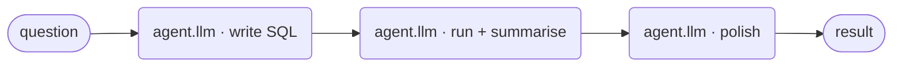
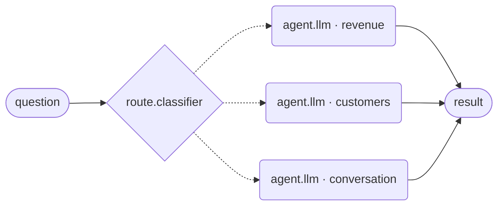
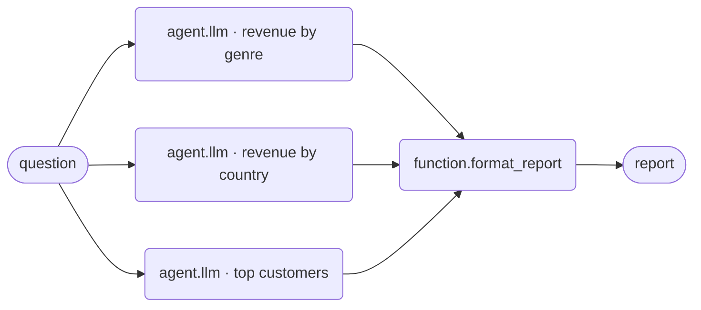
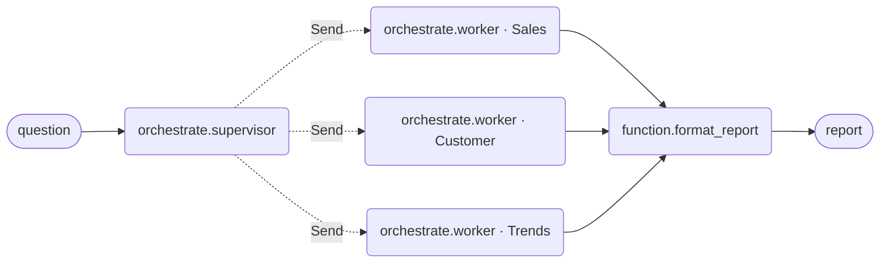
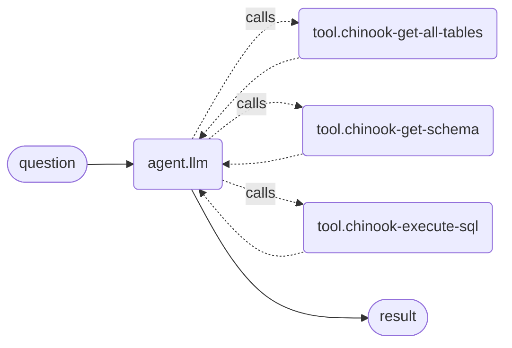

# Patterns

Seven arrangements, one question. Everything below answers the same Chinook
question — *"Which genre earned the most revenue?"* — so the only thing that
varies between sections is the **shape**. That is the point: patterns are not
features, they are how you arrange the same substrate.

The spectrum orders them:

> **Workflows have predetermined code paths. Agents define their own process
> and tool usage.**

Read the list top to bottom and the model is given progressively more
authority. Choosing a pattern *is* choosing how much.

Diagrams are hand-written Mermaid using the same shapes the compiler's own
`draw_mermaid()` output uses — rounded boxes for nodes, dotted lines for
conditional edges. The authoritative picture of any workflow you build is the
top bar's **View compiled graph**, which renders `draw_mermaid()` on the
compiled graph with `xray=True`, locally, with no network call.

---

## 1. Augmented LLM — the substrate

A model with tool calling, structured output and short-term memory. Not a
pattern so much as the thing every pattern is made of.

**Our vocabulary:** one `agent.llm` node. Tools converge on its `tools` bus
(`maxConnections: null` — unlimited); a `skill` input carries the system
instruction; `prompt` carries the task; `result` is the answer.

**Commonly used to:** answer anything that needs one model call plus access to
data it does not have. If a single agent with the right tools can do the job,
stop here — every pattern below is machinery you are choosing to pay for.

---

## 2. Prompt chaining

Step N consumes step N−1's output. Each call is simpler and more accurate than
one call doing everything; the cost is latency.

**Our vocabulary:** `agent.llm.result` → the next `agent.llm.prompt`. This
works because `prompt` declares `accepts: [PORT.text, PORT.result]` — a
*per-port* widening, not a catalogue-wide one, so a result can feed a prompt
without every text input in the product suddenly accepting results. The
Orchestrator's `instruction` and the Router's `question` declare the same
thing, for the same reason.

A gate between steps is a `route.grader` (accept/reject) or a
`route.classifier` (branch on the intermediate answer).

**Commonly used to:** decompose a task whose steps are known in advance —
draft then critique then rewrite; extract then translate; generate SQL, run
it, then explain the rows.

**Fixed vs dynamic:** entirely fixed. You wrote the steps and their order.

---

## 3. Routing

Classify the input, then dispatch to a branch specialised for it.

**Our vocabulary:** `route.classifier`. Its branches are a **field**, and its
output ports are derived from that field — `ports` is a function of node data,
so adding a branch adds a port. Each branch output is `text`, which lands on an
agent's `prompt`. A named fallback branch catches everything unmatched.

This is worth saying out loud because it is where the editor beats writing the
graph by hand: the usual Python spelling of this pattern is a `Literal` union
*and* a dispatch dict that must be kept in sync — one piece of knowledge in two
places. A field-derived port list structurally cannot drift.

**Commonly used to:** send easy questions to a cheap model and hard ones to an
expensive one; separate support categories; keep small talk out of a workflow
that costs money to run.

**Fixed vs dynamic:** the branch *set* is fixed; the *choice* is the model's.

---

## 4. Parallelization

Independent subtasks run at the same time and an aggregator joins the results.
Two flavours: **sectioning** (different subtasks) and **voting** (the same
subtask several times, for confidence).

**Our vocabulary:** there is no `parallel` node, deliberately — the shape is
three edges. Fan out from one source to several `agent.llm` nodes, and join
them on `function.format_report`, whose `candidate` input is a bus
(`maxConnections: null`).

The fan-out source can be an `input.text` or an upstream agent's `result`.

Voting has no aggregation policy today: `function.format_report` concatenates.
If you need majority or best-of, that is a field on the join node, not a new
node type — ask for it.

**Commonly used to:** cut latency on work that does not depend on itself;
review one document against several independent criteria at once; run a
generation and a safety check side by side.

**Fixed vs dynamic:** **fixed.** You can name every subtask before the run
starts — you drew one node per subtask. The moment you cannot, you want the
next pattern.

---

## 5. Orchestrator-worker

A planner decomposes the task into subtasks it could not know in advance,
dispatches them, and a synthesizer joins the results.

**Our vocabulary:** `orchestrate.supervisor` → `orchestrate.worker` →
`function.format_report`. The supervisor's `workers` output is `PORT.worker`
and unbounded: each wire declares one worker **archetype**, and the supervisor
labels every subtask with the archetype it should be dispatched to.

`PORT.worker` is a fan-out *declaration, not control flow*. It compiles to a
LangGraph `Send`, never to a `workflow.json` graph edge. A `Max subtasks`
field bounds the split, because a 500-item numbered list must not become 500
workers.

**Commonly used to:** edit an unknown number of files; research a topic whose
sub-questions only emerge from the first pass; answer "give me a full report
on X" where X determines the sections.

**Fixed vs dynamic:** **dynamic.** The one question that separates this from
parallelization: *can you name the subtasks before you run?* If yes, draw
them (pattern 4). If no, plan them (this one).

---

## 6. Evaluator-optimizer

A generator produces, an evaluator judges, and rejection loops back with
feedback until the answer is accepted.

**Our vocabulary:** `agent.llm.result` → `route.grader.candidate`. The grader
has two outputs: `pass` (a `result`, flowing downstream) and `revise` (a
`feedback`, wired back to the generator's `feedback` input). That backward
wire is the only legal cycle on the canvas — see
[ports and edges](ports-and-edges.md).

Swap the grader for `human.approval` and the same shape becomes
human-in-the-loop, compiling to LangGraph's `interrupt()`.

An agent can also self-grade *inside* the loop, without a second node, via its
**Rubric** field (deepagents' `RubricMiddleware`) — a sub-agent judges the
transcript and the agent iterates. Use the node when the criteria belong to
the workflow; use the field when they belong to the agent.

**Commonly used to:** anything with clear quality criteria and value in
iterating — a translation that needs nuance, a literary rewrite, SQL that must
actually run, a report that must cite figures.

**Fixed vs dynamic:** the loop is fixed; the number of laps is not. Budget it:
LangGraph's `recursion_limit` counts **supersteps, not iterations** — with
fan-out, one lap can cost several — so never read it as "max iterations".

---

## 7. Agent

The endpoint of the spectrum: a model in a loop with tools, deciding for
itself which to call, how often, and when it is done.

**Our vocabulary:** `agent.llm` with a fat `tools` bus — the same node as
pattern 1, given more tools and less structure around it. Its `Runtime` field
picks the runtime, mirroring LangChain's own layering (a different axis from
the palette's atomic-design tiers — `agent.llm` is a molecule at every setting):

| Field value | Construct | When |
| --- | --- | --- |
| `Agent · create_agent` | the minimal configurable harness | the default |
| `Deep agent · create_deep_agent` | a pre-assembled middleware stack on top of `create_agent` | planning, filesystem, sub-agents |
| `Custom · hand-written node` | a `StateGraph` node you wrote | when neither fits |

`create_deep_agent` is `create_agent` **plus a fixed slot assembly, not plus
subclassing** — which is why deep and react are siblings in our node model,
differing only by which middleware preset they declare.

**Commonly used to:** open-ended problems where the number of steps cannot be
predicted and the environment gives feedback the model can act on — exploring
a schema, debugging, "find out X and tell me".

**Fixed vs dynamic:** fully dynamic. You are trading predictability and cost
for capability, so keep the tool surface honest: every tool the agent can
reach is a thing it may decide to do.

---

## Beyond one graph

Two things this list does not cover, because they compose *patterns* rather
than sit among them — the palette's only two **organisms**:

- **`workflow.subgraph`** mounts another workflow as one node. Store Analytics
  mounts `chinook-nl-to-sql` this way for deep SQL questions — real reuse, not
  a demo prop.
- **`team.workflow`** mounts a whole supervisor-plus-workers package behind a
  single card.

A subagent invoked as a tool is **isolated**: it receives a task and reports a
result as a `ToolMessage`. It never sees the parent's message history or graph
state. Do not design as though it does.

## Choosing, in one table

| If… | Use |
| --- | --- |
| one call plus data gets it done | augmented LLM |
| you can write the steps down, in order | prompt chaining |
| the input falls into known categories | routing |
| you can name every subtask now | parallelization |
| only the run can name the subtasks | orchestrator-worker |
| quality criteria are clear and iteration helps | evaluator-optimizer |
| you genuinely cannot predict the steps | agent |
