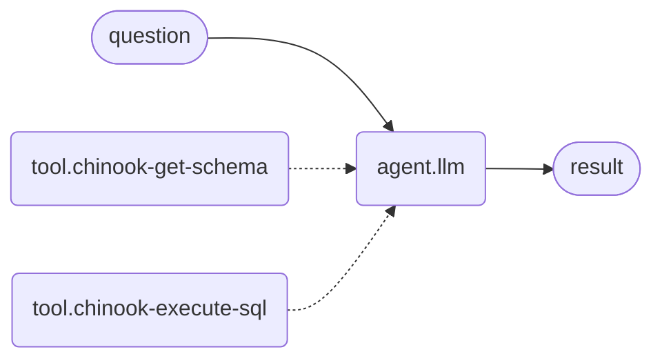
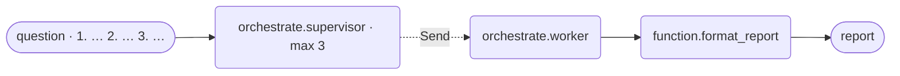
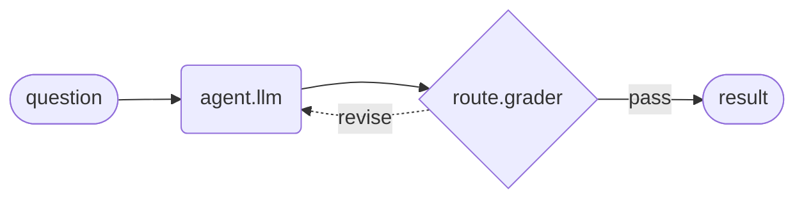

# Patterns

Seven arrangements, one question. Everything below answers the same Chinook
question — *"Which genre earned the most revenue?"* — so the only thing that
varies between sections is the **shape**. That is the point: patterns are not
features, they are how you arrange the same substrate.

The spectrum orders them:

> **Workflows have predetermined code paths. Agents define their own process
> and tool usage.**

Read the list top to bottom and the model is given progressively more
authority. Choosing a pattern *is* choosing how much.

Diagrams are hand-written Mermaid using the same shapes the compiler's own
`draw_mermaid()` output uses — rounded boxes for nodes, dotted lines for
conditional edges. The authoritative picture of any workflow you build is the
top bar's **View compiled graph**, which renders `draw_mermaid()` on the
compiled graph, locally, with no network call.

That editor view still draws each mount as one flat box (`workflow-gallery`
56). `openstategraph graph <package>` and `CompiledWorkflow.mermaid()` open
them: a mount is a closure over the child's `invoke()` rather than a LangGraph
subgraph, so LangGraph's `xray` cannot see into it, and the compiler records
what it built instead. An agent is a closure too and stays one box — it has no
second document to show.

---

## 1. Augmented LLM — the substrate

A model with tool calling, structured output and short-term memory. Not a
pattern so much as the thing every pattern is made of.

**Our vocabulary:** one `agent.llm` node. Tools converge on its `tools` bus
(`maxConnections: null` — unlimited); a `skill` input carries the system
instruction; `prompt` carries the task; `result` is the answer.

**Commonly used to:** answer anything that needs one model call plus access to
data it does not have. If a single agent with the right tools can do the job,
stop here — every pattern below is machinery you are choosing to pay for.

---

## 2. Prompt chaining

Step N consumes step N−1's output. Each call is simpler and more accurate than
one call doing everything; the cost is latency.

**Our vocabulary:** `agent.llm.result` → the next `agent.llm.prompt`. This
works because `prompt` declares `accepts: [PORT.text, PORT.result]` — a
*per-port* widening, not a catalogue-wide one, so a result can feed a prompt
without every text input in the product suddenly accepting results. The
Orchestrator's `instruction` and the Router's `question` declare the same
thing, for the same reason.

A gate between steps is a `route.grader` (accept/reject) or a
`route.classifier` (branch on the intermediate answer).

**Commonly used to:** decompose a task whose steps are known in advance —
draft then critique then rewrite; extract then translate; generate SQL, run
it, then explain the rows.

**Fixed vs dynamic:** entirely fixed. You wrote the steps and their order.

---

## 3. Routing

Classify the input, then dispatch to a branch specialised for it.

**Our vocabulary:** `route.classifier`. Its branches are a **field**, and its
output ports are derived from that field — `ports` is a function of node data,
so adding a branch adds a port. Each branch output is `text`, which lands on an
agent's `prompt`. A named fallback branch catches everything unmatched.

This is worth saying out loud because it is where the editor beats writing the
graph by hand: the usual Python spelling of this pattern is a `Literal` union
*and* a dispatch dict that must be kept in sync — one piece of knowledge in two
places. A field-derived port list structurally cannot drift.

**Commonly used to:** send easy questions to a cheap model and hard ones to an
expensive one; separate support categories; keep small talk out of a workflow
that costs money to run.

**Fixed vs dynamic:** the branch *set* is fixed; the *choice* is the model's.

---

## 4. Parallelization

Independent subtasks run at the same time and an aggregator joins the results.
Two flavours: **sectioning** (different subtasks) and **voting** (the same
subtask several times, for confidence).

> **This section described a limitation that has been lifted.** The shape
> every parallelization diagram in the literature uses — one source fanning out
> to *N* drawn nodes whose results converge on one join — used to fail
> *silently*: it validated, it ran, and it produced `# Title` followed by
> `_No results._`, because `function.format_report` read only `worker_results`
> and drawn nodes write `outputs`.
>
> **The join now gathers its upstream nodes' outputs when no worker fan-out
> reached it** (`every-workflow-green` 27). It had to: a `route.classifier` in
> `matchMode: "all"` produces exactly this shape on every compound question —
> several desks running in parallel, converging on one join — and refusing it
> would mean throwing one desk's work away, since `answer` is
> `LATEST_NONEMPTY` and one branch would silently win.
>
> Two things below are still true and still worth reading. **A supervisor
> fan-out is the right tool when the sections are decided by the request** —
> it dispatches *N* instances of one worker with task identity, which drawn
> nodes cannot do. And the canvas still guides you there. What is no longer
> true is that the drawn shape produces nothing.

**Our vocabulary:** there is no `parallel` node, and there is no drawn
parallelism either. Fan-out is always `orchestrate.supervisor` →
`orchestrate.worker` — the same three nodes as pattern 5 — and what makes this
pattern *sectioning* rather than planning is that **you name the sections in
the request**, as an enumerated list, instead of leaving them to the run.

The supervisor's split is deterministic on numbered lists, semicolons and
literal "and" (`backend/openstategraph/abc/orchestrator.py::deterministic_split`),
so a request written as *N* numbered items becomes exactly *N* subtasks, in
order, with no model call in the split. Set `Max subtasks` to *N*. That is as
close to fixed parallelism as this substrate has, and it is genuinely fixed:
you decided the sections, not the model.

**Each worker sees only its own item.** A leading summary above a numbered list
is treated as context and dropped, not dispatched — so an item reading *"1.
Correctness: what does this get wrong?"* arrives at a worker with no idea what
*this* is, and the worker says so. **Write every item self-contained**, naming
its subject in full. This is the single thing that decides whether the pattern
returns three answers or three requests for clarification.

The `w` box is **one drawn node that runs three times**, once per subtask. That
is the whole difference from the picture you expected: the parallelism is in
the `Send` fan-out at run time, never in the number of boxes.

Voting is the same shape with the same item repeated. Aggregation has no policy
today: `function.format_report` concatenates, under `### task-1`, `### task-2`
… headings taken from the subtask ids rather than from your wording. If you
need majority, best-of, or your own section titles, that is a field on the join
node, not a new node type — ask for it.

### Why the intuitive shape cannot work

`function.format_report` **ignores its incoming edges**. Its runtime reads two
state keys and nothing else (`backend/openstategraph/compile/node_runtime.py`,
`_format_report_function`): `worker_results`, keyed by subtask id, and
`subtasks`. It reports the intersection, and renders `_No results._` when that
intersection is empty.

Only two node types ever write those keys — `orchestrate.supervisor` writes
`subtasks`, `orchestrate.worker` writes `worker_results[task_id]` — and
`task_id` has exactly one source: the `Send` payload the compiler constructs in
`_fan_out_router`. A `Send` is emitted only for an edge whose **destination
port type is `worker`**. An `agent.llm.result → candidate` edge is not that, so
it compiles to a plain `add_edge`: it sequences the join after the agents and
transfers no data at all. Meanwhile `agent.llm` writes `outputs[node_id]` and
`answer`, never `worker_results`.

So all fan-in here is `Send`-shaped. The three edges are decoration, and
nothing reports the loss:

- `openstategraph validate` says `VALID` — `candidate` is a bus
  (`maxConnections: null`) and `required`, so three edges satisfy both the
  capacity rule and the required-port check. The port advertised a fan-in the
  runtime does not implement.
- the **canvas preview disagrees with the compiler**. Its browser executor does
  read `candidate` and will show you a joined document; its own source says it
  "demonstrates the formatting, not the fan-out/join semantics that only the
  compiled graph has". A shape could look right in preview and return
  `_No results._` on the backend.

**What changed (production-ready ticket 31), and what did not.** The port now
declares who may feed it — a source that itself takes a `worker` input, which
is exactly "is dispatched by a fan-out" — so the editor refuses the agent edge
at connection time with a sentence naming the mechanism, and the preview can no
longer render a join the compiler will not produce. A join that never was
dispatched to now says so in its own report instead of a bare `_No results._`.

**Static fan-in is still unbuilt.** Refusing the drawing is not implementing
it: there is no mechanism by which *N* drawn nodes' outputs converge into one
join, and adding one is a multi-writer state key with a named reducer, not a
port change. A hand-authored or generated document can still contain the edge —
`openstategraph validate` does not enforce this rule, only the canvas does.

Recorded as `.scratch/workflow-gallery/tickets/14-all-fan-in-is-send-shaped.md`
and `.scratch/production-ready/tickets/30-a-documented-pattern-that-produces-nothing.md`.

**Commonly used to:** cut latency on work that does not depend on itself;
review one document against several independent criteria at once; run a
generation and a safety check side by side.

**Fixed vs dynamic:** **fixed sections, dynamic mechanism.** You can name every
subtask before the run starts — but you name them in the *request*, never by
drawing one node per subtask. The moment you cannot name them, you want the
next pattern, which is the same three nodes with the enumeration removed.

---

## 5. Orchestrator-worker

A planner decomposes the task into subtasks it could not know in advance,
dispatches them, and a synthesizer joins the results.

**Our vocabulary:** `orchestrate.supervisor` → `orchestrate.worker` →
`function.format_report`. The supervisor's `workers` output is `PORT.worker`
and unbounded: each wire declares one worker **archetype**, and the supervisor
labels every subtask with the archetype it should be dispatched to.

`PORT.worker` is a fan-out *declaration, not control flow*. It compiles to a
LangGraph `Send`, never to a `workflow.json` graph edge. A `Max subtasks`
field bounds the split, because a 500-item numbered list must not become 500
workers.

**The split has two strategies, and your rules choose between them.** With no
authored rules the supervisor uses the deterministic splitter — numbered lists,
semicolons, "and" — which is free, reproducible and good at the punctuated
lists it was written for. Write something in `Planning rules` (or wire a skill
into `skill`) and, provided a model is configured, `orchestrator_for` builds a
`PlanningOrchestrator` instead: one planning call that decides both **how many**
subtasks there are, bounded by `Max subtasks`, and which archetype each goes to.

So the field is `Planning rules` and it means what it says. (This page called
it `Dispatch rules` and said "no rule there can change *how many* subtasks
there are" until 2026-08-16; that was true of the deterministic path only, and
the shipped `team` template's own rules string is exactly the case it got
wrong.) `Rules mode` still switches between appending your prose to the
node's own and replacing it, as everywhere else.

**Commonly used to:** edit an unknown number of files; research a topic whose
sub-questions only emerge from the first pass; answer "give me a full report
on X" where X determines the sections.

**Fixed vs dynamic:** **dynamic.** The one question that separates this from
parallelization: *can you name the subtasks before you run?* If yes, enumerate
them in the request and cap `Max subtasks` (pattern 4). If no, let the split
find them (this one). Either way it is these three nodes — the two patterns
differ in what you write, not in what you draw.

Each wire out of `workers` is one **archetype**, so drawing three worker nodes
here means three *kinds* of worker, not three subtasks; a single default worker
catching every subtask is the common case and is what
`examples/parallel-workers-join` ships.

---

## 6. Evaluator-optimizer

A generator produces, an evaluator judges, and rejection loops back with
feedback until the answer is accepted.

**Our vocabulary:** `agent.llm.result` → `route.grader.candidate`. The grader
has two outputs: `pass` (a `result`, flowing downstream) and `revise` (a
`feedback`, wired back to the generator's `feedback` input). That backward
wire is the only legal cycle on the canvas — see
[ports and edges](ports-and-edges.md).

Swap the grader for `human.approval` and the same shape becomes
human-in-the-loop, compiling to LangGraph's `interrupt()`.

An agent can also self-grade *inside* the loop, without a second node, via its
**Rubric** field (deepagents' `RubricMiddleware`) — a sub-agent judges the
transcript and the agent iterates. Use the node when the criteria belong to
the workflow; use the field when they belong to the agent.

**Commonly used to:** anything with clear quality criteria and value in
iterating — a translation that needs nuance, a literary rewrite, SQL that must
actually run, a report that must cite figures.

**Fixed vs dynamic:** the loop is fixed; the number of laps is not. Budget it
in the document — `"settings": {"recursionLimit": 200}` — and every run of that
workflow gets it, from the editor, from `/chat` and from `openstategraph run`;
a caller that names its own number still overrides. It counts **supersteps, not
iterations** — with fan-out, one lap can cost several — so never read it as
"max iterations", and never size it as if it were a lap count.

---

## 7. Agent

The endpoint of the spectrum: a model in a loop with tools, deciding for
itself which to call, how often, and when it is done.

**Our vocabulary:** `agent.llm` with a fat `tools` bus — the same node as
pattern 1, given more tools and less structure around it. Its `Runtime` field
picks the runtime, mirroring LangChain's own layering (a different axis from
the palette's atomic-design tiers — `agent.llm` is a molecule at every setting):

| Field value | Construct | When |
| --- | --- | --- |
| `Agent · create_agent` | the minimal configurable harness | the default |
| `Deep agent · create_deep_agent` | a pre-assembled middleware stack on top of `create_agent` | planning, filesystem, sub-agents |
| `Custom · hand-written node` | a `StateGraph` node you wrote | when neither fits |

`create_deep_agent` is `create_agent` **plus a fixed slot assembly, not plus
subclassing** — which is why deep and react are siblings in our node model,
differing only by which middleware preset they declare.

**Commonly used to:** open-ended problems where the number of steps cannot be
predicted and the environment gives feedback the model can act on — exploring
a schema, debugging, "find out X and tell me".

**Fixed vs dynamic:** fully dynamic. You are trading predictability and cost
for capability, so keep the tool surface honest: every tool the agent can
reach is a thing it may decide to do.

---

## Beyond one graph

One thing this list does not cover, because it composes *patterns* rather than
sits among them — the palette's only **organism**:

- **`workflow.subgraph`** mounts another workflow as one node. The hidden
  `concierge` gateway mounts both `chinook-assistant` and
  `workflow-architect` this way, one per branch.

  **Called out because it changed:** the Chinook Assistant used to mount a
  second Chinook package on its `data_query` branch, and this page described
  that as the demonstration. It no longer does — the two Chinook documents
  were collapsed into one, so the analyst is an inline branch. The atom is
  unchanged and still exercised by a shipped document, but no *visible*
  example demonstrates it any more. That cost was accepted deliberately: the
  second document was hidden, and it was the one the editor opened.
  **A second organism used to be listed here.** `team.workflow` mounted the
  same way and compiled identically — `node_runtime` dispatched both type ids
  to one builder with no branch — and this page's advice was to pick a card.
  Schema v3 removed the choice by removing the type: what distinguished Team
  was a glyph, an `outcome` field that turned out to be documentation, and a
  "loops until its grader passes" note the *child document* earns, none of
  which is a kind of node. `MIGRATIONS[2]` in `backend/openstategraph/schema.py`
  rewrites the old id, preserving node id, slug, `overrides` and the authored
  `outcome`; `workflow.subgraph` gained the `outcome` field to receive it.

  A **team** is therefore a package *shape* — supervisor, workers and a grader
  wired into a revision loop — that you mount like any other workflow.
  `openstategraph new <slug> --template team` still scaffolds it.

  **The cost that decides a mount is the child's, not the card's.** Reach for a
  supervisor-plus-workers package when the work genuinely has several worker
  *roles*; with one role you pay for a planning call and a fan-out you do not
  use, and an agent → grader revision loop gives the same retry semantics for
  one call less. That is why no shipped example mounts one — a fact about the
  packages we ship, not about the node type.

A subagent invoked as a tool is **isolated**: it receives a task and reports a
result as a `ToolMessage`. It never sees the parent's message history or graph
state. Do not design as though it does.

## Choosing, in one table

| If… | Use |
| --- | --- |
| one call plus data gets it done | augmented LLM |
| you can write the steps down, in order | prompt chaining |
| the input falls into known categories | routing |
| you can name every subtask now | parallelization |
| only the run can name the subtasks | orchestrator-worker |
| quality criteria are clear and iteration helps | evaluator-optimizer |
| you genuinely cannot predict the steps | agent |
